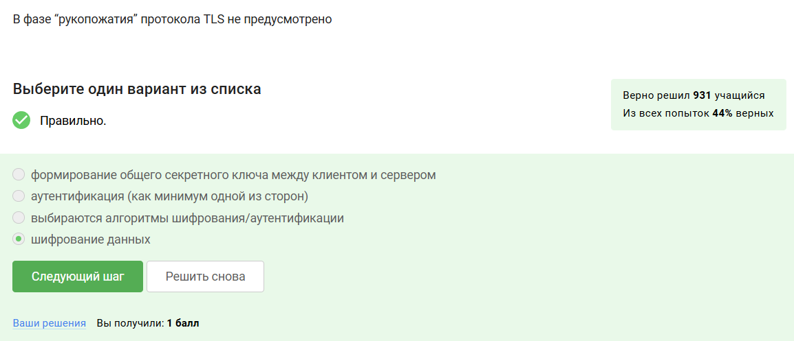
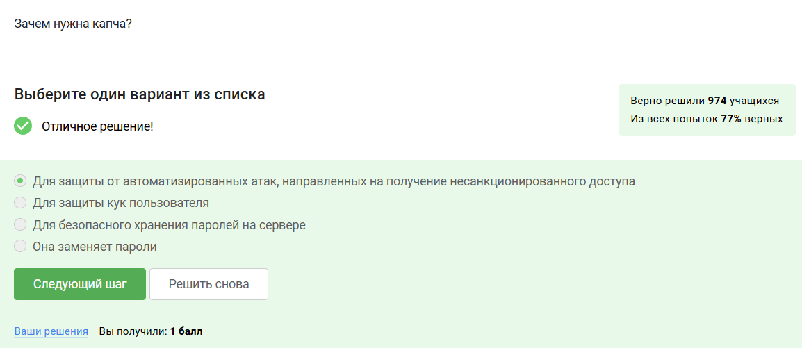
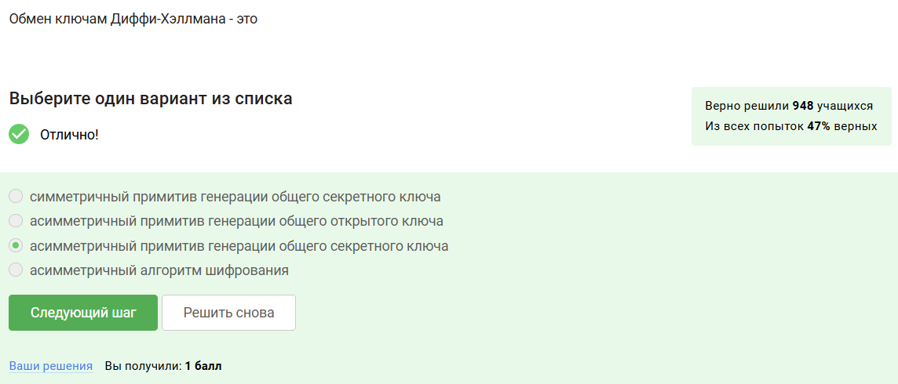

---
## Front matter
lang: ru-RU
title: Презентация по внешнему курсу
subtitle: Основы информационной безопасности
author:
  - Бережной И. А.
institute:
  - Российский университет дружбы народов, Москва, Россия

## i18n babel
babel-lang: russian
babel-otherlangs: english

## Formatting pdf
toc: false
toc-title: Содержание
slide_level: 2
aspectratio: 169
section-titles: true
theme: metropolis
header-includes:
 - \metroset{progressbar=frametitle,sectionpage=progressbar,numbering=fraction}
---

# Информация

## Докладчик

:::::::::::::: {.columns align=center}
::: {.column width="70%"}

  * Бережной Иван Александрович
  * студент 2-ого курса
  * Российский университет дружбы народов
  * [1132236041@pfur.ru](mailto:1132236041@pfur.ru)

:::
::::::::::::::

## Цель

Ознакомиться с основными понятиями информационной безопасности.

## Задачи

Пройти все этапы курса.
	
# Выполнение тестов

## Прохождение первого этапа

В первом этапе речь шла о безопасности в сети: протоколах передачи данных, общении серверов, файлах куки, анонимизации и беспроводных сетях.

{#fig:001 width=70%}

## Прохождение второго этапа

Во втором этапе нам рассказали об опасностях в сети и о том, как их устарняли, как от них защищаться. Речь шла о шифровании дисков, паролях, фишинге, вирусах и мессенджерах а также о том, как устроена безопасность в этих мессенджерах.

{#fig:002 width=70%}

## Прохождение третьего этапа

В третьем этапе говорилось о криптографии, в том числе об устройстве блокчейна, цифровых подписях, ассиметричном шифровании и т.п.

{#fig:003 width=70%}

## Вывод

В результате прохождения внешнего курса мы узнали, как обеспечивается безопасность в сети, с помощью каких протоколов общаются устройства в ней, как защитить свои устройства и аккаунты от злоумышленников, а также рассмотрели криптографическую составляющую сети.
