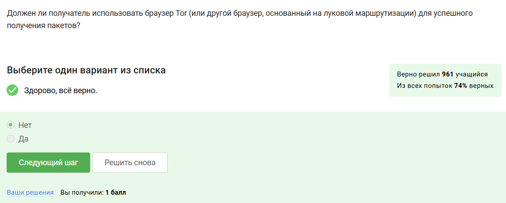
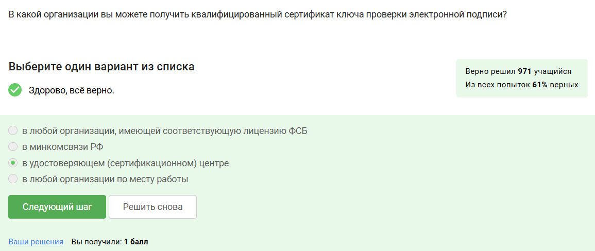

---
## Front matter
title: "Отчёт по прохождению внешнего курса"
subtitle: "Основы информационной безопасности"
author: "Бережной Иван Александрович"

## Generic otions
lang: ru-RU
toc-title: "Содержание"

## Bibliography
bibliography: bib/cite.bib
csl: pandoc/csl/gost-r-7-0-5-2008-numeric.csl

## Pdf output format
toc: true # Table of contents
toc-depth: 2
lof: true # List of figures
fontsize: 12pt
linestretch: 1.5
papersize: a4
documentclass: scrreprt
## I18n polyglossia
polyglossia-lang:
  name: russian
  options:
	- spelling=modern
	- babelshorthands=true
polyglossia-otherlangs:
  name: english
## I18n babel
babel-lang: russian
babel-otherlangs: english
## Fonts
mainfont: IBM Plex Serif
romanfont: IBM Plex Serif
sansfont: IBM Plex Sans
monofont: IBM Plex Mono
mainfontoptions: Ligatures=Common,Ligatures=TeX,Scale=0.94
romanfontoptions: Ligatures=Common,Ligatures=TeX,Scale=0.94
sansfontoptions: Ligatures=Common,Ligatures=TeX,Scale=MatchLowercase,Scale=0.94
monofontoptions: Scale=MatchLowercase,Scale=0.94,FakeStretch=0.9
mathfontoptions:
## Biblatex
biblatex: true
biblio-style: "gost-numeric"
biblatexoptions:
  - parentracker=true
  - backend=biber
  - hyperref=auto
  - language=auto
  - autolang=other*
  - citestyle=gost-numeric
## Pandoc-crossref LaTeX customization
figureTitle: "Рис."
tableTitle: "Таблица"
listingTitle: "Листинг"
lofTitle: "Список иллюстраций"
lotTittle: "Список таблиц"
lolTitle: "Листинги"
## Misc options
indent: true
header-includes:
  - \usepackage{indentfirst}
  - \usepackage{float} # keep figures where there are in the text
  - \floatplacement{figure}{H} # keep figures where there are in the text
---

# Цель работы

Ознакомиться с основными понятиями информационной безопасности.

# Задание

Пройти все этапы курса.

# Выполнение тестов

Поскольку тестов в совокупности не так много, а на отдельных этапах их вообще мало, я решил, что более целессобразно будет сделать один отчёт по прохождению всего курса, нежели делать множество отчётов по каждому этапу.

## Прохождение первого этапа
Протоколом прикладного уровня является HTTPS, поскольку он устанавливает правила общения с внешним ресурсом (рис. [-@fig:001]).

{#fig:001 width=70%}

Протокол TCP работает на транспортном уровне, поскольку определяет правила передачи пакетов (рис. [-@fig:002]).

{#fig:002 width=70%}

Валидными IP-адресами считаются адреса, содержащие 4 октета, каждый из которых состоит из чисел в диапазоне от 0 до 255 (рис. [-@fig:003]).

{#fig:003 width=70%}

DNS - специальные сервера, которые сообщают устройству, какой IP привязан к домену (рис. [-@fig:004]).

{#fig:004 width=70%}

Последовательность протоколов определяется абстрактной моделью OSI (рис. [-@fig:005]).

{#fig:005 width=70%}

HTTP не шифрует данные (рис. [-@fig:006]).

{#fig:006 width=70%}

Для успешной передачи данных в протоколе HTTPS была реализована двухфазная передача, состоящая из рукопожатия и непосредственно передачи (рис. [-@fig:007]).

{#fig:007 width=70%}

В каждом устройстве определена своя версия протокола TLS. При общении выбирается наименьшая, поскольку присутствует поддержка обратной совместимости (рис. [-@fig:008]).

{#fig:008 width=70%}

Шифрование данных происходит после рукопожатия (рис. [-@fig:009]).

{#fig:009 width=70%}

Куки не хранят чувствительные данные, поскольку их не составляет труда перехватить (рис. [-@fig:010]).

{#fig:010 width=70%}

Куки не используются для улучшения надёжности соединения, поскольку создавались с другой целью (рис. [-@fig:011]).

{#fig:011 width=70%}

Куки генерируются сервером в ходе общения с пользователем, затем отправляются этому пользователю и хранятся на его хосте (рис. [-@fig:012]).

{#fig:012 width=70%}

Сессионные куки хранятся до тех пор, пока эта сессия не завершится. Отсюда и название (рис. [-@fig:013]).

{#fig:013 width=70%}

В луковой маршрутизации используется 3 ноды (рис. [-@fig:014]).

{#fig:014 width=70%}

Благодря тройному шифрованию адрес получателя известен только отправителю и выходной ноде. Таким образом ни одна нода не обладает полной информацией о всех участниках "общения" (рис. [-@fig:015] и рис. [-@fig:016]).

{#fig:015 width=70%}

{#fig:016 width=70%}

Получателю необязательно использовать Tor при общении, поскольку всю дешифровку осуществляют ноды (рис. [-@fig:017]).

{#fig:017 width=70%}

Определение Wi-Fi (рис. [-@fig:018]).

{#fig:018 width=70%}

Wi-Fi работает на канальном уровне, поскольку связывает локальные устройства с интернетом (рис. [-@fig:019]).

{#fig:019 width=70%}

WEP считается устаревшим и небезопасным, потому что его ключ шифрования ограничен 40 битами (рис. [-@fig:020]).

{#fig:020 width=70%}

Данные между хостом и роутером передаются в зашифрованном виде, дабы исклюлчить использование данных при перехвате (рис. [-@fig:021]).

{#fig:021 width=70%}

Для домашней сети используется WPA2 Personal, поскольку это удобнее для пользователей, ведь Enterprise использует динамические ключи (рис. [-@fig:022]).

{#fig:022 width=70%}

## Прохождение второго этапа

Загрузочный сектор диска можно и рекомендуется шифровать (рис. [-@fig:023]).

{#fig:023 width=70%}

Шифрование дисков симметричное, поскольку оно гораздо быстрее асимметричного, что идёт в плюс пользователям (рис. [-@fig:024]).

{#fig:024 width=70%}

BitLocker установлен в Windows по умолчанию, а VeraCrypt является наиболее популярной сторонней программой для шифрования дисков (рис. [-@fig:025]).

{#fig:025 width=70%}

Пароли должны состоять из цифр, символов и спец. символов, чтобы подобрать было труднее (рис. [-@fig:026]).

{#fig:026 width=70%}

Пароли безопасно хранить в менеджере паролей, а пароль от него самого нужно хранить на нецифровом носителе или в голове (рис. [-@fig:027]).

{#fig:027 width=70%}

Капча используется для защиты от брутфорса ботами (рис. [-@fig:028]).

{#fig:028 width=70%}

Хэширование паролей нужно, чтобы сделать потенциальные утечки баз данных менее опасными (рис. [-@fig:029]).

{#fig:029 width=70%}

Соль помогает изменить хэш слабого пароля, но это не защищает от перебора (рис. [-@fig:030]).

{#fig:030 width=70%}

Все методы, которые усложняют пароль или замедляют возможность перебора, помогут защитить от брутфорса (рис. [-@fig:031]).

{#fig:031 width=70%}

Фишинговые ссылки похожи на настоящие, но имеют в пути другие доменные зоны или как-то видоизменяют сам путь (рис. [-@fig:032]).

{#fig:032 width=70%}

Фишинговый имейл может прийти от знакомого адреса, если используется слабый протокол почтового сервиса (рис. [-@fig:033]).

{#fig:033 width=70%}

Спуфинг уже практически неактуален, поскольку придуманы более защищённые протоколы отправки Email (рис. [-@fig:034]).

{#fig:034 width=70%}

Троян маскирутеся под легитимную программу и пытается получить контроль над устройством (рис. [-@fig:035]).

{#fig:035 width=70%}

Ключ шифрования в протоколе Signal генерируется при отправке первого сообщения пользователем (рис. [-@fig:036]).

{#fig:036 width=70%}

Сквозное шифрование использует пару ключей для конфеденциального общения узлов (рис. [-@fig:037]).

{#fig:037 width=70%}

Для правильной работы криптографических примитивов требуется наличие пары ключей у всех участников общения (рис. [-@fig:038]).

## Прохождение третьего этапа

{#fig:038 width=70%}

Криптографическая хэш-функция не обеспечивает конфиденциальность захэшированных данных, поскольку её невозможно вычислить в обратном порядке (рис. [-@fig:039]).

{#fig:039 width=70%}

Перечисление алгоритмов цифровой подписи (рис. [-@fig:040]).

{#fig:040 width=70%}

Код аутентификации сообщения относится к симметричным примитивам, поскольку используется симметричное шифрование (рис. [-@fig:041]).

{#fig:041 width=70%}

Определение обмена ключами Диффи-Хеллмана (рис. [-@fig:042]).

{#fig:042 width=70%}

Протокол электронной цифровой подписи отностися к протоколам с публичным ключом, ведь пользователи могут проверить подпись этим ключом (рис. [-@fig:043]).

{#fig:043 width=70%}

Механизм работы верификации ЭЦП (рис. [-@fig:044]).

{#fig:044 width=70%}

ЭПС не обеспечивает конфиденциальность, поскольку содержит информацию о пользователе, сделавшем эту подпись (рис. [-@fig:045]).

{#fig:045 width=70%}

Усиленная квалифицированная электронная подпись при отправки налоговой отчётности в ФНС требуется для обеспечения юридической значимости, безопасности и достоверности (рис. [-@fig:046]). 

{#fig:046 width=70%}

Сертификаты для доменов выдают сертифицированные центры (рис. [-@fig:047]).

{#fig:047 width=70%}

Список платёжных систем (рис. [-@fig:048]).

{#fig:048 width=70%}

Многофакторная аутентификация подразумевает собой ввод нескольких ключей для доступа к информации (рис. [-@fig:049]).

{#fig:049 width=70%}

Для безопасности платёжных счетов пользователей при онлайн оплатах сегодня используется многофакторная аутентификация перед банком-эмитентом (рис. [-@fig:050]).

{#fig:050 width=70%}

Устройство proof of work (рис. [-@fig:051]).

{#fig:051 width=70%}

Консенсус позволяет участникам блокчейна согласовывать операции без доверия друг к другу (рис. [-@fig:052]).

{#fig:052 width=70%}

Все участники блокчейна хранят цифровую подпись (рис. [-@fig:053]).

{#fig:053 width=70%}

Данный курс не предусматривает выдачу сертификатов, поэтому прикладываю скриншот-доказательство прохождения курса (рис. [-@fig:054]).

## Сертификат

{#fig:054 width=70%}

# Выводы

В результате прохождения внешнего курса мы узнали, как обеспечивается безопасность в сети, с помощью каких протоколов общаются устройства в ней, как защитить свои устройства и аккаунты от злоумышленников, а также рассмотрели криптографическую составляющую сети.
