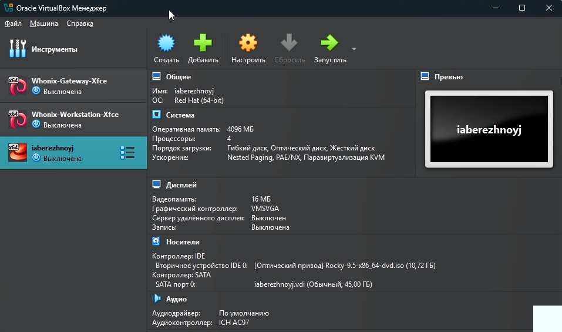
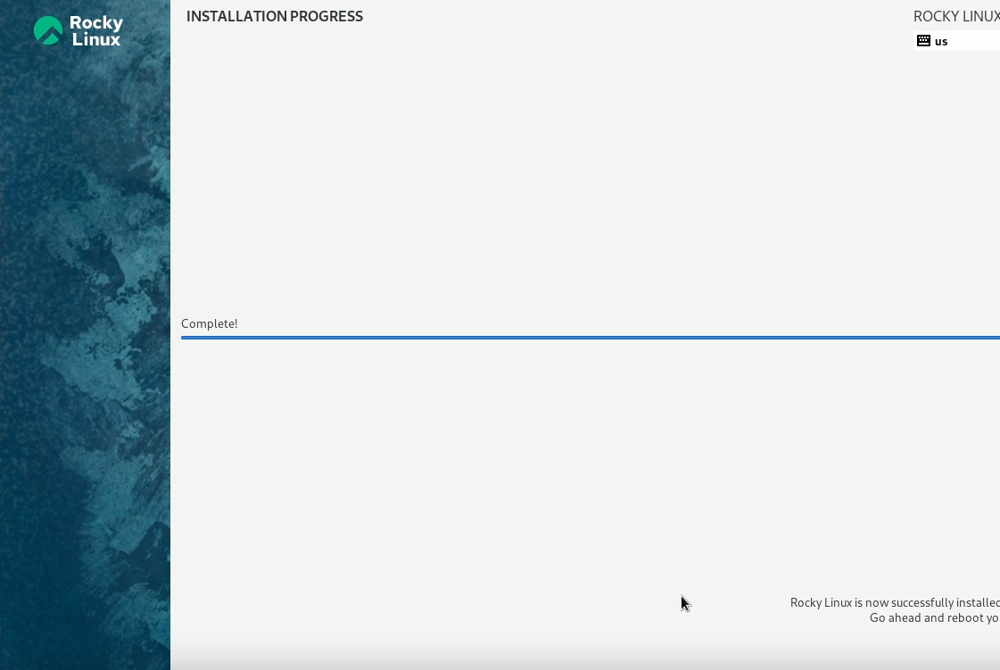
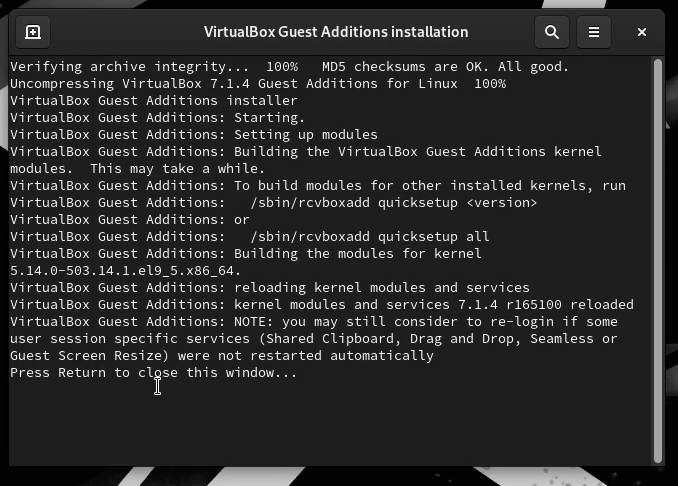
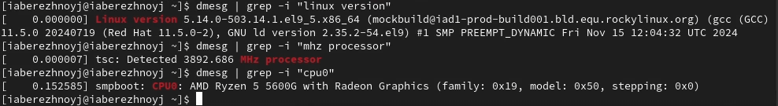
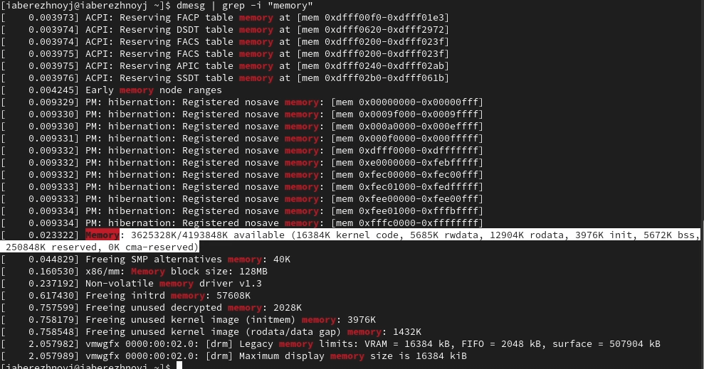
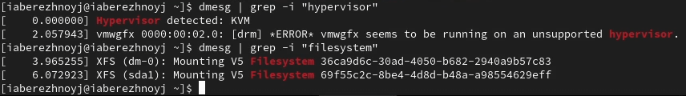

---
## Front matter
lang: ru-RU
title: Презентация по лабораторной работе №1
subtitle: Основы информационной безопасности
author:
  - Бережной И. А.
institute:
  - Российский университет дружбы народов, Москва, Россия

## i18n babel
babel-lang: russian
babel-otherlangs: english

## Formatting pdf
toc: false
toc-title: Содержание
slide_level: 2
aspectratio: 169
section-titles: true
theme: metropolis
header-includes:
 - \metroset{progressbar=frametitle,sectionpage=progressbar,numbering=fraction}
---

# Информация

## Докладчик

:::::::::::::: {.columns align=center}
::: {.column width="70%"}

  * Бережной Иван Александрович
  * студент 2-ого курса
  * Российский университет дружбы народов
  * [1132236041@pfur.ru](mailto:1132236041@pfur.ru)

:::
::::::::::::::

## Цель

Целью данной работы является приобретение практических навыков
установки операционной системы на виртуальную машину, настройки минимально необходимых для дальнейшей работы сервисов.

## Задачи

1. Установить операционную систему Rocky на виртуальную машину
2. Получить следующую информацию:
	1. Версия ядра Linux (Linux version).
	2. Частота процессора (Detected Mhz processor).
	3. Модель процессора (CPU0).
	4. Объем доступной оперативной памяти (Memory available).
	5. Тип обнаруженного гипервизора (Hypervisor detected).
	6. Тип файловой системы корневого раздела.
	7. Последовательность монтирования файловых систем.
	
# Выполнение лабораторной работы

## Выполнение лабораторной работы

Так как я выполняю задание из дома, нужно создать новую ВМ и установить ОС на неё.

{#fig:001 width=70%}

## Установка Rocky

Выбираем языки, диск, дополнительное ПО, настраиваем root и создаём пользователя. Начинаем установку и ждём.

{#fig:011 width=70%}

## Установка гостевых дополнений

{#fig:013 width=70%}

## Дополнительное задание

Требовалось воспользоваться командой dmesg для поиска информации об устройстве и ОС

{#fig:016 width=70%}

## Дополнительное задание

{#fig:017 width=70%}

## Дополнительное задание

{#fig:018 width=70%}

## Вывод

В ходе выполнения лабораторной работы мы научились создавать виртуальные машины и устанавливать ОС на них. Также поработали с терминалом и вспомнили основные команды.
