---
## Front matter
title: "Отчёт по лабораторной работе №1"
subtitle: "Основы информационной безопасности"
author: "Бережной Иван Александрович"

## Generic otions
lang: ru-RU
toc-title: "Содержание"

## Bibliography
bibliography: bib/cite.bib
csl: pandoc/csl/gost-r-7-0-5-2008-numeric.csl

## Pdf output format
toc: true # Table of contents
toc-depth: 2
lof: true # List of figures
fontsize: 12pt
linestretch: 1.5
papersize: a4
documentclass: scrreprt
## I18n polyglossia
polyglossia-lang:
  name: russian
  options:
	- spelling=modern
	- babelshorthands=true
polyglossia-otherlangs:
  name: english
## I18n babel
babel-lang: russian
babel-otherlangs: english
## Fonts
mainfont: IBM Plex Serif
romanfont: IBM Plex Serif
sansfont: IBM Plex Sans
monofont: IBM Plex Mono
mainfontoptions: Ligatures=Common,Ligatures=TeX,Scale=0.94
romanfontoptions: Ligatures=Common,Ligatures=TeX,Scale=0.94
sansfontoptions: Ligatures=Common,Ligatures=TeX,Scale=MatchLowercase,Scale=0.94
monofontoptions: Scale=MatchLowercase,Scale=0.94,FakeStretch=0.9
mathfontoptions:
## Biblatex
biblatex: true
biblio-style: "gost-numeric"
biblatexoptions:
  - parentracker=true
  - backend=biber
  - hyperref=auto
  - language=auto
  - autolang=other*
  - citestyle=gost-numeric
## Pandoc-crossref LaTeX customization
figureTitle: "Рис."
tableTitle: "Таблица"
listingTitle: "Листинг"
lofTitle: "Список иллюстраций"
lotTittle: "Список таблиц"
lolTitle: "Листинги"
## Misc options
indent: true
header-includes:
  - \usepackage{indentfirst}
  - \usepackage{float} # keep figures where there are in the text
  - \floatplacement{figure}{H} # keep figures where there are in the text
---

# Цель работы

Целью данной работы является приобретение практических навыков
установки операционной системы на виртуальную машину, настройки минимально необходимых для дальнейшей работы сервисов.

# Задание

1. Установить операционную систему Rocky на виртуальную машину
2. Получить следующую информацию:
	1. Версия ядра Linux (Linux version).
	2. Частота процессора (Detected Mhz processor).
	3. Модель процессора (CPU0).
	4. Объем доступной оперативной памяти (Memory available).
	5. Тип обнаруженного гипервизора (Hypervisor detected).
	6. Тип файловой системы корневого раздела.
	7. Последовательность монтирования файловых систем.

# Выполнение лабораторной работы

Создадим новую виртуальную машину в VirtualBox. Зададим имя, количество ядер (4), объём оперативной памяти (4гб) и размер диска (45гб). Подключим ISO-файл с ос Rocky (рис. [-@fig:001]).

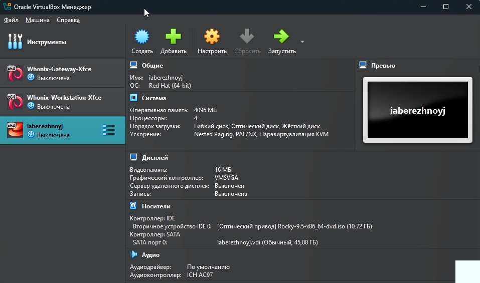{#fig:001 width=70%}

Выберем основной язык ОС (рис. [-@fig:002]).

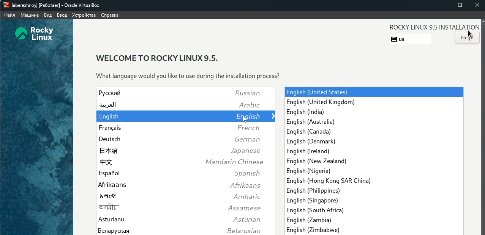{#fig:002 width=70%}

И дополнительный язык. Разумеется, русский (рис. [-@fig:003]).

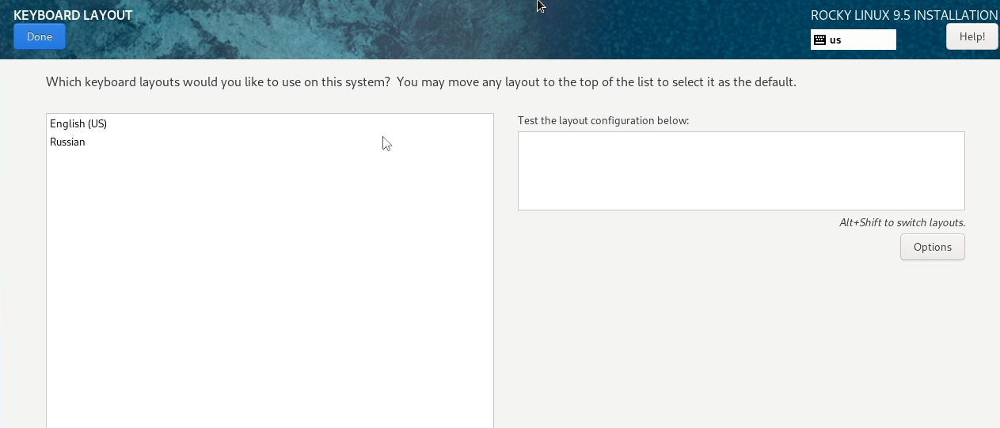{#fig:003 width=70%}

Выберем языки для клавиатуры. Также русский и английский. Не забудем установить горячие клавиши для смены языка. В данном случае alt+shift (рис. [-@fig:004]).

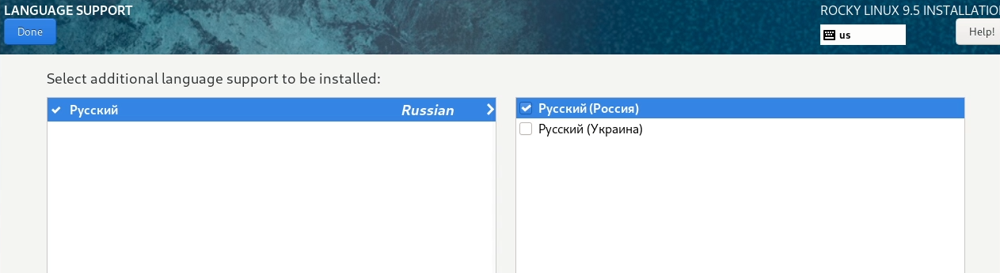{#fig:004 width=70%}

Установим дополнительное ПО, которое нам пригодится, а именно графическую оболочку и инструменты разработчика (рис. [-@fig:005]).

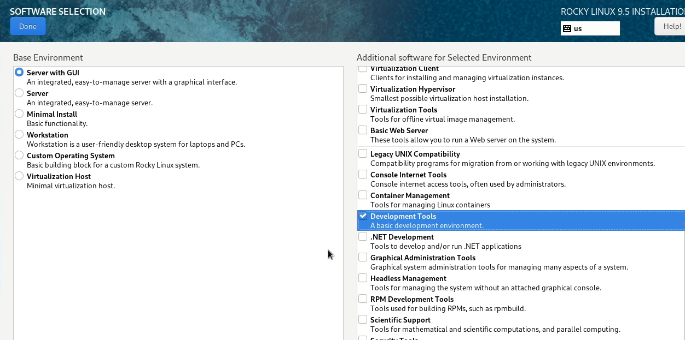{#fig:005 width=70%}

Выберем диск, куда установим ОС (рис. [-@fig:006]), отключим KDUMP (рис. [-@fig:007]) и настроим выход в интернет (рис. [-@fig:008]).

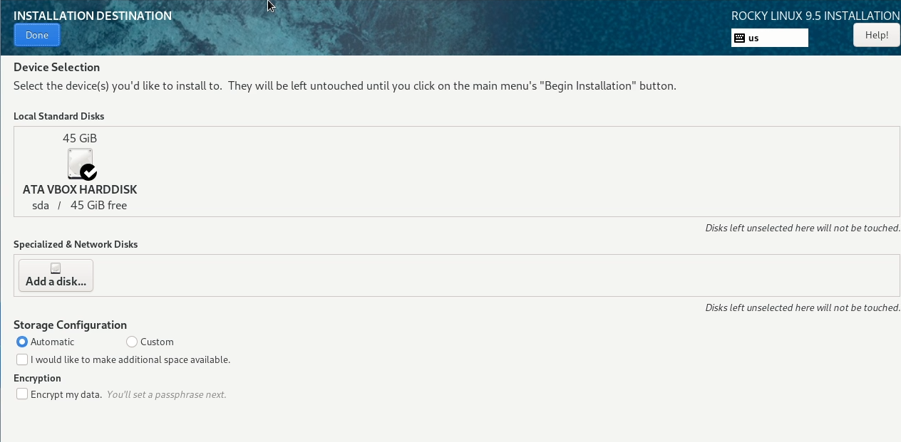{#fig:006 width=70%}

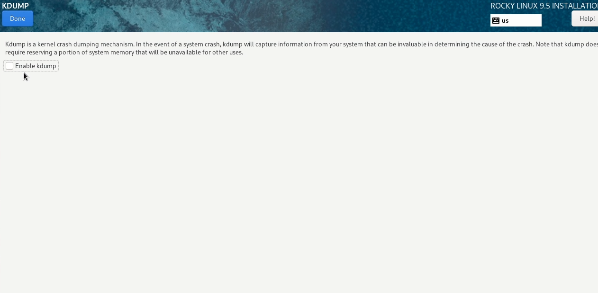{#fig:007 width=70%}

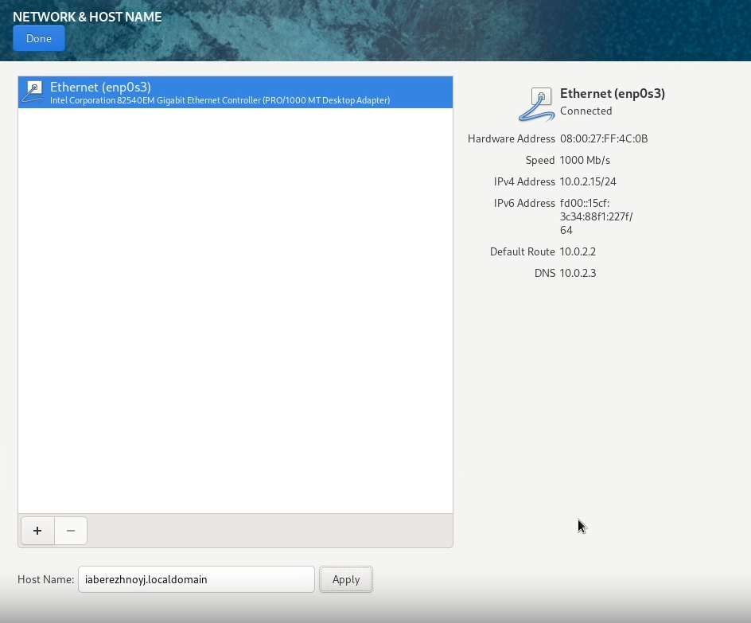{#fig:008 width=70%}

Установим пароль для рута (рис. [-@fig:009]), а также создадим пользователя с правами администратора (рис. [-@fig:010]).

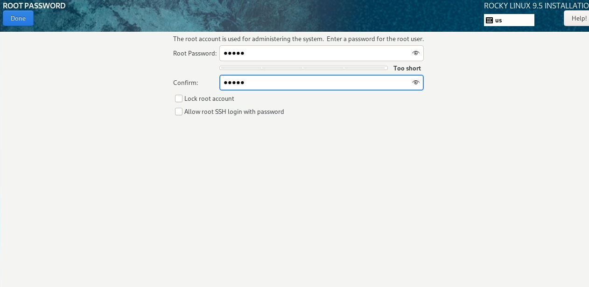{#fig:009 width=70%}

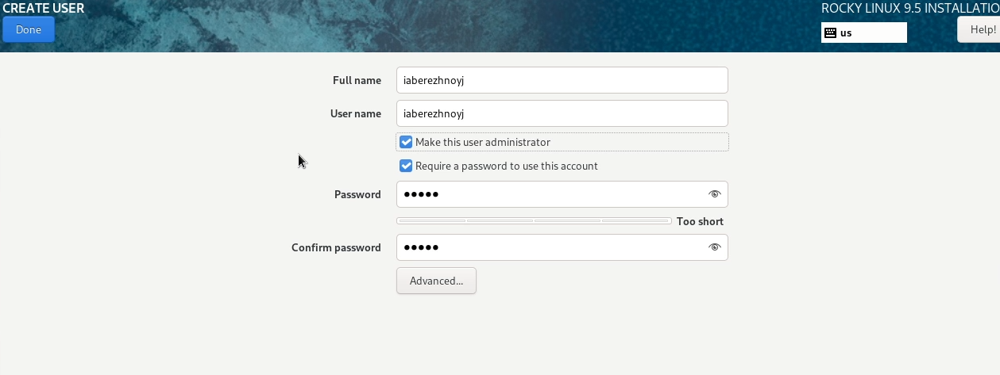{#fig:010 width=70%}

После завершения установки (рис. [-@fig:011]) нам откроется графическая оболочка (рис. [-@fig:012]). Установим дополнения гостевой ос в разделе "Устройства" -> "Подключить образо дополнений гостевой ОС" в верхнем меню VirtualBox (рис. [-@fig:013]). Жмём "Run" (рис. [-@fig:014]).

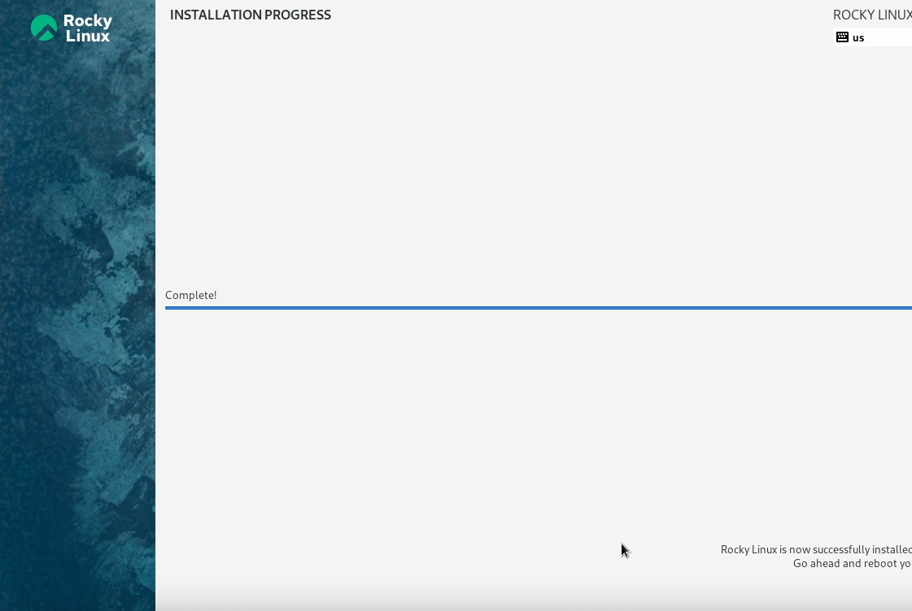{#fig:011 width=70%}

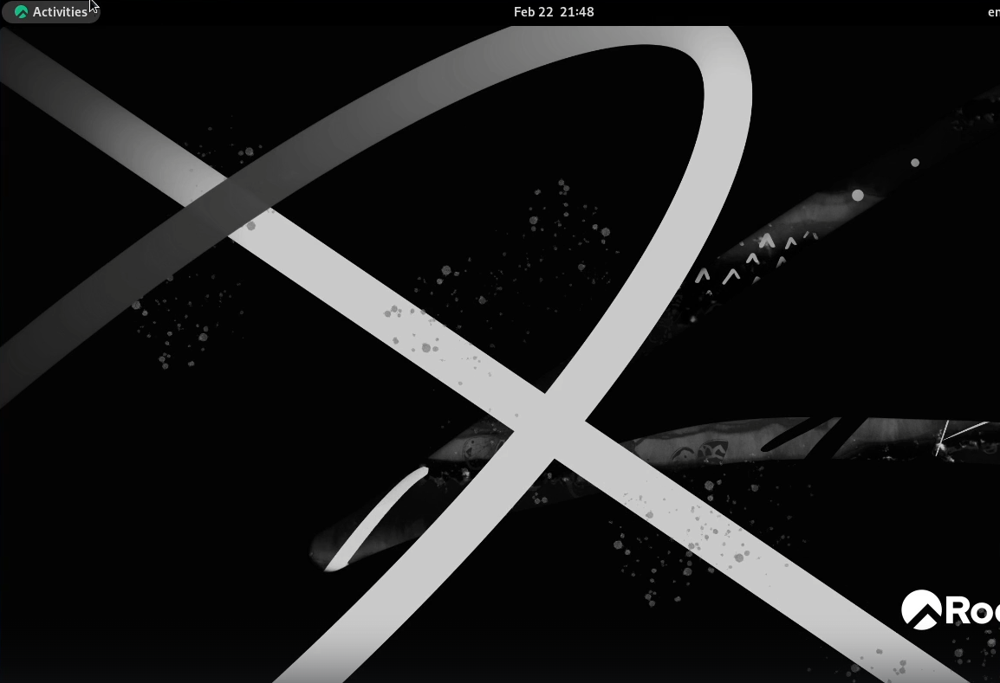{#fig:012 width=70%}

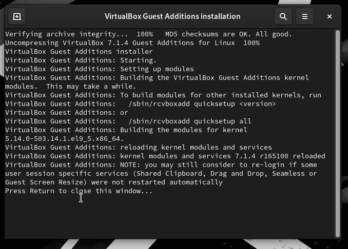{#fig:013 width=70%}

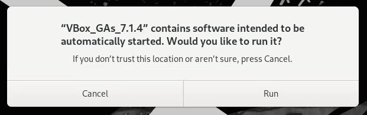{#fig:014 width=70%}

# Выполнение домашнего задания

Откроем командную строку и впишем `dmesg | less` (рис. [-@fig:015]). Чтобы выйти из процесса, нажмём Ctrl+Z. 

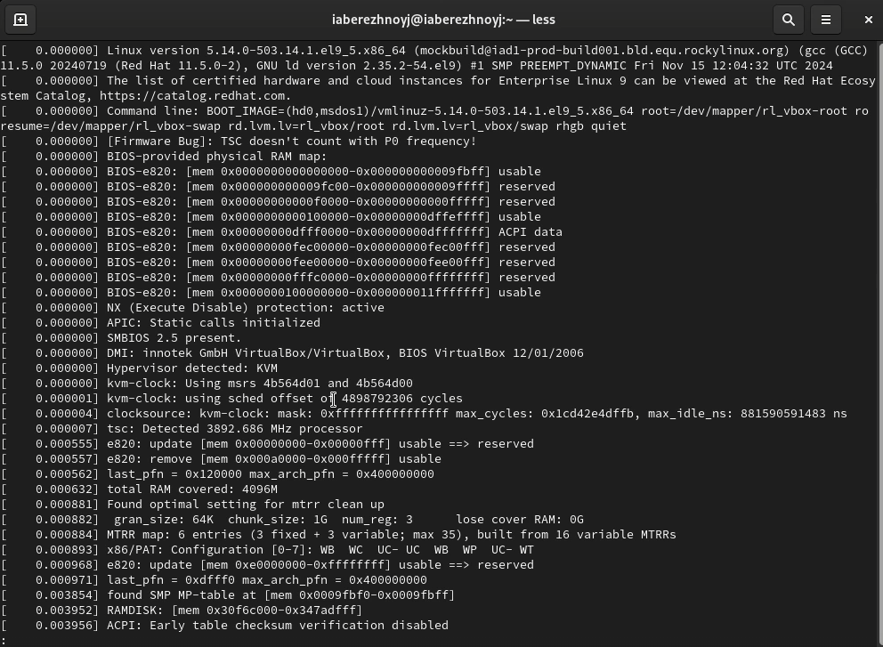{#fig:015 width=70%}

Теперь найдём запрашиваемую информацию, такую как версию ядра, частота процессора и модель процессора (рис. [-@fig:016]).

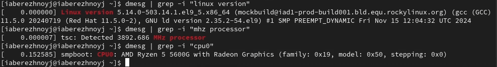{#fig:016 width=70%}

Посмотрим на свободный объём оперативной памяти (рис. [-@fig:017]).

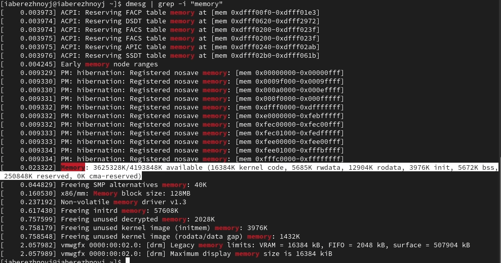{#fig:017 width=70%}

И, наконец, проверим тип виртуализации (KVM), тип файловой системы корневого раздела (XFS) и порядок монтирования файловых систем (рис. [-@fig:018]).

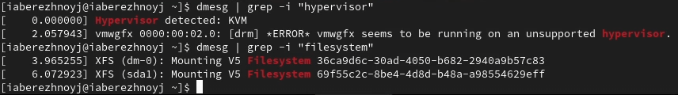{#fig:018 width=70%}

# Ответы на контрольные вопросы

1. Учётная запись пользователя в Linux содержит: имя пользователя (логин), UID (идентификатор пользователя), GID (идентификатор основной группы), домашний каталог, оболочку (shell), хеш пароля, дополнительные группы.

2. Перечислим команды для:
	* Получения справки по команде: `man`
	* Перемещения по файловой системе: `cd`
	* Просмотра содержимого каталога: `ls`
	* Определения объёма каталога: `du`
	* Работы с директориями и файлами: `mkdir` - создание папки, `rmdir` - удаление папки, `rm` - удаление файла, `touch` - создание файла.
	* Изменения прав: `chmod`
	* Просмотра истории команд: `history`
	
3. Файловая система (ФС) – это способ хранения и организации данных на диске.
Примеры файловых систем:
- ext4 – стандартная для Linux, поддерживает файлы до 16 ТБ.
- XFS – быстрая, подходит для больших файлов и серверов.
- NTFS – файловая система Windows, поддерживается в Linux.
- FAT32 – совместима с разными ОС, но ограничение на файл 4 ГБ.

4. Чтобы посмотреть, какие файлы подмонтированы в ОС, нужно вбить команду `mount`.

5. Зависший процесс можно удалить командой `kill`.

# Выводы

В ходе выполнения лабораторной работы мы научились создавать виртуальные машины и устанавливать ОС на них. Также поработали с терминалом и вспомнили основные команды.
