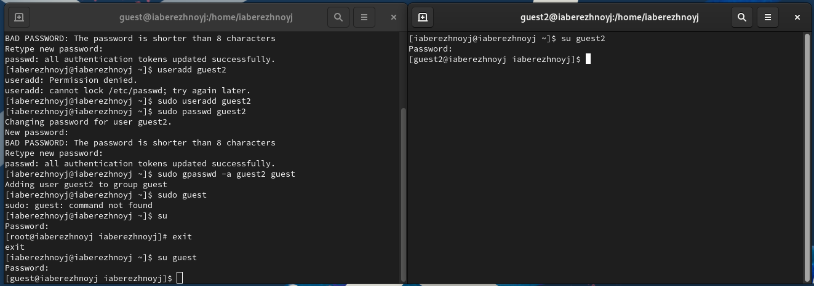
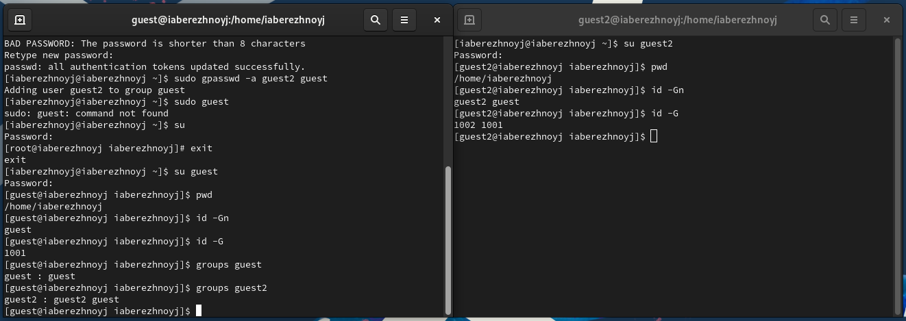
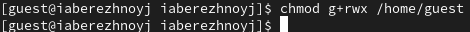

---
## Front matter
lang: ru-RU
title: Презентация по лабораторной работе №3
subtitle: Основы информационной безопасности
author:
  - Бережной И. А.
institute:
  - Российский университет дружбы народов, Москва, Россия

## i18n babel
babel-lang: russian
babel-otherlangs: english

## Formatting pdf
toc: false
toc-title: Содержание
slide_level: 2
aspectratio: 169
section-titles: true
theme: metropolis
header-includes:
 - \metroset{progressbar=frametitle,sectionpage=progressbar,numbering=fraction}
---

# Информация

## Докладчик

:::::::::::::: {.columns align=center}
::: {.column width="70%"}

  * Бережной Иван Александрович
  * студент 2-ого курса
  * Российский университет дружбы народов
  * [1132236041@pfur.ru](mailto:1132236041@pfur.ru)

:::
::::::::::::::

## Цель

Получение практических навыков работы в консоли с атрибутами файлов для групп пользователей.

## Задачи

1. Добавить пользователя guest и установить для него пароль.
2. Добавить пользователя guest2.
3. Войти в систему от имени созданных пользователей в двух окнах терминала.
4. Сравнить имена пользователей и группы, в которые они входят.
5. Заполнить две таблицы.
	
# Выполнение лабораторной работы

## Добавление пользователей
Добавим новых пользователей guest и guest2, зададим им пароли и зайдём в систему каждого в двух разных терминалах.

{#fig:001 width=70%}

## Проверка информации
Для каждого пользователя проверим имена и группы, к которым они принадлежат. Сравним полученные данные с выводом команды `cat /etc/group`

{#fig:002 width=70%}

## Изменение прав
От имени пользователя guest изменим права директории /home/guest, разрешив все действия для пользователей группы, а также снимем с директории /home/guest/dir1 все атрибуты.

{#fig:003 width=70%}

## Создание таблиц
Заполним две таблицы, связанные с правами пользователей.

Таблица 3.2:
|Операция|Права на директорию|Права на файл|
|----|----|----|
|Создание файла|```d----wx-— (030)```|```--------— (000)```|
|Удаление файла|```d----wx-— (030)```|```--------— (000)```|
|Чтение файла|```d-----x-— (010)```|```----r---— (040)```|
|Запись в файл|```d-----x-— (010)```|```-----w--— (020)```|
|Переименование файла|```d----wx-— (030)```|```--------— (000)```|
|Создание поддиректории|```d----wx-— (030)```|```--------— (000)```|
|Удаление поддиректории|```d----wx-— (030)```|```--------— (000)```|


## Вывод

В ходе выполнения лабораторной работы мы получили практические навыки работы в консоли с атрибутами файлов для групп пользователей.

## Список литературы

[1] Основы информационной безопасности, РУДН: https://esystem.rudn.ru/pluginfile.php/2580594/mod_resource/content/4/003-lab_discret_2users.pdf
