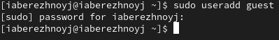
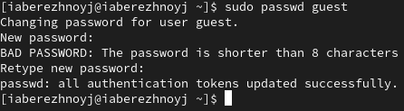
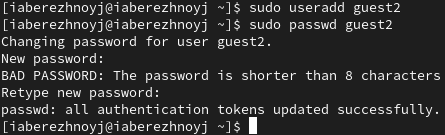
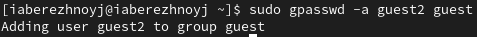
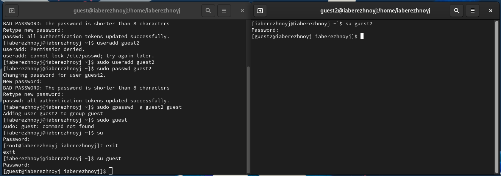
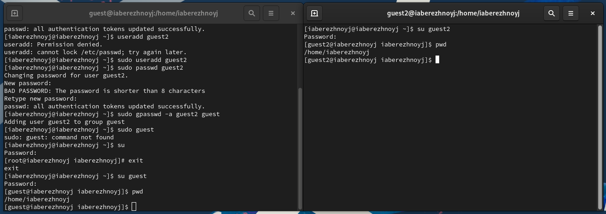
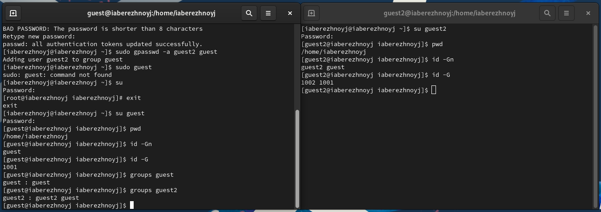
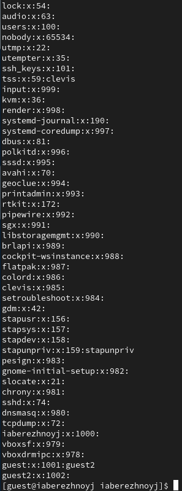
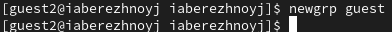
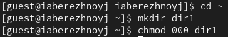

---
## Front matter
title: "Отчёт по лабораторной работе №3"
subtitle: "Основы информационной безопасности"
author: "Бережной Иван Александрович"

## Generic otions
lang: ru-RU
toc-title: "Содержание"

## Bibliography
bibliography: bib/cite.bib
csl: pandoc/csl/gost-r-7-0-5-2008-numeric.csl

## Pdf output format
toc: true # Table of contents
toc-depth: 2
lof: true # List of figures
fontsize: 12pt
linestretch: 1.5
papersize: a4
documentclass: scrreprt
## I18n polyglossia
polyglossia-lang:
  name: russian
  options:
	- spelling=modern
	- babelshorthands=true
polyglossia-otherlangs:
  name: english
## I18n babel
babel-lang: russian
babel-otherlangs: english
## Fonts
mainfont: IBM Plex Serif
romanfont: IBM Plex Serif
sansfont: IBM Plex Sans
monofont: IBM Plex Mono
mainfontoptions: Ligatures=Common,Ligatures=TeX,Scale=0.94
romanfontoptions: Ligatures=Common,Ligatures=TeX,Scale=0.94
sansfontoptions: Ligatures=Common,Ligatures=TeX,Scale=MatchLowercase,Scale=0.94
monofontoptions: Scale=MatchLowercase,Scale=0.94,FakeStretch=0.9
mathfontoptions:
## Biblatex
biblatex: true
biblio-style: "gost-numeric"
biblatexoptions:
  - parentracker=true
  - backend=biber
  - hyperref=auto
  - language=auto
  - autolang=other*
  - citestyle=gost-numeric
## Pandoc-crossref LaTeX customization
figureTitle: "Рис."
tableTitle: "Таблица"
listingTitle: "Листинг"
lofTitle: "Список иллюстраций"
lotTittle: "Список таблиц"
lolTitle: "Листинги"
## Misc options
indent: true
header-includes:
  - \usepackage{indentfirst}
  - \usepackage{float} # keep figures where there are in the text
  - \floatplacement{figure}{H} # keep figures where there are in the text
---

# Цель работы

Получение практических навыков работы в консоли с атрибутами файлов для групп пользователей.

# Задание

1. Добавить пользователя guest и установить для него пароль.
2. Добавить пользователя guest2.
3. Войти в систему от имени созданных пользователей в двух окнах терминала.
4. Сравнить имена пользователей и группы, в которые они входят.
5. Заполнить две таблицы.

# Теоретическое введение

1. Типы прав доступа
	1.1. Чтение (r): Разрешает просмотр содержимого файла или списка файлов в каталоге.

	1.2. Запись (w): Разрешает изменение содержимого файла или создание/удаление файлов в каталоге.

	1.3. Выполнение (x): Разрешает выполнение файла как программы или вход в каталог.

2. Категории пользователей
	- Владелец (Owner): Пользователь, который создал файл или каталог.

	- Группа (Group): Набор пользователей, которые имеют общие права доступа к файлу или каталогу.

	- Остальные (Others): Все остальные пользователи, не являющиеся владельцем или членом группы.

3. Представление прав доступа
Права доступа отображаются в виде символов или цифр:

Символьное представление: rwxr-xr--

Первые три символа (rwx) — права владельца.

Следующие три (r-x) — права группы.

Последние три (r--) — права остальных.

Цифровое представление: Каждое право имеет числовое значение:

r = 4

w = 2

x = 1
Например, rwxr-xr-- в цифровом виде: 754.

4. Команды для управления правами доступа
chmod: Изменяет права доступа.

Пример: chmod 755 file.txt — устанавливает права rwxr-xr-x.

chown: Изменяет владельца файла или каталога.

Пример: chown user:group file.txt — изменяет владельца и группу.

chgrp: Изменяет группу файла или каталога.

Пример: chgrp group file.txt.

5. Особые права доступа
SUID (Set User ID): Если установлен для файла, он выполняется с правами владельца.

SGID (Set Group ID): Если установлен для файла, он выполняется с правами группы. Для каталога — новые файлы наследуют группу каталога.

Sticky Bit: Если установлен для каталога, только владелец файла может удалить или переименовать файл в этом каталоге.

# Выполнение лабораторной работы

Создадим учётную запись пользователя guest (рис. [-@fig:001]) и установим для него пароль (рис. [-@fig:002]).

{#fig:001 width=70%}

{#fig:002 width=70%}

Аналогичным образом второго пользователя с именем guest2 (рис. [-@fig:003]).

{#fig:003 width=70%}

Добавим пользователя guest2 в группу guest (рис. [-@fig:004]).

{#fig:004 width=70%}

Войдём в систему каждого пользователя в двух разных консолях (рис. [-@fig:005]) и в обоих терминалах определим директорию, в которой находимся на данный момент (рис. [-@fig:006]). Они совпадают с приглашениями командных строк.

{#fig:005 width=70%}

{#fig:006 width=70%}

Посмотрим на имена пользователей и группы, в которые они входят (рис. [-@fig:007]). Информация совпадает с тем, что выводит команда cat /etc/group (рис. [-@fig:008]).

{#fig:007 width=70%}

{#fig:008 width=70%}

От имени пользователя guest2 выполним регистрацию пользователя guest2 в группе guest (рис. [-@fig:009]).

{#fig:009 width=70%}

От имени пользователя guest изменим права директории /home/guest, разрешив все действия для пользователей группы (рис. [-@fig:010]).

{#fig:010 width=70%}

От имени пользователя guest снимем с директории /home/guest/dir1 все атрибуты (рис. [-@fig:011]).

{#fig:011 width=70%}

## Заполнение таблицы 3.1
|Права директории|Права файла|Создание файла|Удаление файла|Запись в файл|Чтение файла|Смена директории|Просмотр файлов в директории|Переименование файла|Смена атрибутов файла|
|:---|:---|--|--|--|--|--|--|--|--|
|```d-------— (000)```|```--------— (000)```| - | - | - | - | - | - | - | - |
|```d-----x-— (010)```|```--------— (000)```| - | - | - | - | - | - | - | + |
|```d----w--— (020)```|```--------— (000)```| - | - | - | - | - | - | - | - |
|```d----wx-— (030)```|```--------— (000)```| + | + | - | - | + | - | + | + |
|```d---r---— (040)```|```--------— (000)```| - | - | - | - | - | + | - | - |
|```d---r-x-— (050)```|```--------— (000)```| - | - | - | - | + | + | - | + |
|```d---rw--— (060)```|```--------— (000)```| - | - | - | - | - | + | - | - |
|```d---rwx-— (070)```|```--------— (000)```| + | + | - | - | + | + | + | + |
|```d-------— (000)```|```------x-— (010)```| - | - | - | - | - | - | - | - |
|```d-----x-— (010)```|```------x-— (010)```| - | - | - | - | - | - | - | + |
|```d----w--— (020)```|```------x-— (010)```| - | - | - | - | - | - | - | - |
|```d----wx-— (030)```|```------x-— (010)```| + | + | - | - | + | - | + | + |
|```d---r---— (040)```|```------x-— (010)```| - | - | - | - | - | + | - | - |
|```d---r-x-— (050)```|```------x-— (010)```| - | - | - | - | + | + | - | + |
|```d---rw--— (060)```|```------x-— (010)```| - | - | - | - | - | + | - | - |
|```d---rwx-— (070)```|```------x-— (010)```| + | + | - | - | + | + | + | + |
|```d-------— (000)```|```-----w--— (020)```| - | - | - | - | - | - | - | - |
|```d-----x-— (010)```|```-----w--— (020)```| - | - | + | - | - | - | - | + |
|```d----w--— (020)```|```-----w--— (020)```| - | - | - | - | - | - | - | - |
|```d----wx-— (030)```|```-----w--— (020)```| + | + | + | - | + | - | + | + |
|```d---r---— (040)```|```-----w--— (020)```| - | - | - | - | - | + | - | - |
|```d---r-x-— (050)```|```-----w--— (020)```| - | - | + | - | + | + | - | + |
|```d---rw--— (060)```|```-----w--— (020)```| - | - | - | - | - | + | - | - |
|```d---rwx-— (070)```|```-----w--— (020)```| + | + | + | - | + | + | + | + |
|```d-------— (000)```|```-----wx-— (030)```| - | - | - | - | - | - | - | - |
|```d-----x-— (010)```|```-----wx-— (030)```| - | - | + | - | - | - | - | + |
|```d----w--— (020)```|```-----wx-— (030)```| - | - | - | - | - | - | - | - |
|```d----wx-— (030)```|```-----wx-— (030)```| + | + | + | - | + | - | + | + |
|```d---r---— (040)```|```-----wx-— (030)```| - | - | - | - | - | + | - | - |
|```d---r-x-— (050)```|```-----wx-— (030)```| - | - | + | - | + | + | - | + |
|```d---rw--— (060)```|```-----wx-— (030)```| - | - | - | - | - | + | - | - |
|```d---rwx-— (070)```|```-----wx-— (030)```| + | + | + | - | + | + | + | + |
|```d-------— (000)```|```----r---— (040)```| - | - | - | - | - | - | - | - |
|```d-----x-— (010)```|```----r---— (040)```| - | - | - | + | + | - | - | + |
|```d----w--— (020)```|```----r---— (040)```| - | - | - | - | - | - | - | - |
|```d----wx-— (030)```|```----r---— (040)```| + | + | - | + | + | - | + | + |
|```d---r---— (040)```|```----r---— (040)```| - | - | - | - | - | + | - | - |
|```d---r-x-— (050)```|```----r---— (040)```| - | - | - | + | + | + | - | + |
|```d---rw--— (060)```|```----r---— (040)```| - | - | - | - | - | + | - | - |
|```d---rwx-— (070)```|```----r---— (040)```| + | + | - | + | + | + | + | + |
|```d-------— (000)```|```----r-x-— (050)```| - | - | - | - | - | - | - | - |
|```d-----x-— (010)```|```----r-x-— (050)```| - | - | - | + | + | - | - | + |
|```d----w--— (020)```|```----r-x-— (050)```| - | - | - | - | - | - | - | - |
|```d----wx-— (030)```|```----r-x-— (050)```| + | + | - | + | + | - | + | + |
|```d---r---— (040)```|```----r-x-— (050)```| - | - | - | - | - | + | - | - |
|```d---r-x-— (050)```|```----r-x-— (050)```| - | - | - | + | + | + | - | + |
|```d---rw--— (060)```|```----r-x-— (050)```| - | -| - | - | - | + | - | - |
|```d---rwx-— (070)```|```----r-x-— (050)```| + | + | - | + | + | + | + | + |
|```d-------— (000)```|```----rw--— (060)```| - | - | - | - | - | - | - | - |
|```d-----x-— (010)```|```----rw--— (060)```| - | - | + | + | - | - | - | + |
|```d----w--— (020)```|```----rw--— (060)```| - | - | - | - | - | - | - | - |
|```d----wx-— (030)```|```----rw--— (060)```| + | + | + | + | + | - | + | + |
|```d---r---— (040)```|```----rw--— (060)```| - | - | - | - | - | + | - | - |
|```d---r-x-— (050)```|```----rw--— (060)```| - | - | + | + | + | + | - | + |
|```d---rw--— (060)```|```----rw--— (060)```| - | - | - | - | - | + | - | - |
|```d---rwx-— (070)```|```----rw--— (060)```| + | + | + | + | + | + | + | + |
|```d-------— (000)```|```----rwx-— (070)```| - | - | - | - | - | - | - | - |
|```d-----x-— (010)```|```----rwx-— (070)```| - | - | + | + | + | - | - | + |
|```d----w--— (020)```|```----rwx-— (070)```| - | - | - | - | - | - | - | - |
|```d----wx-— (030)```|```----rwx-— (070)```| + | + | + | + | + | - | + | + |
|```d---r---— (040)```|```----rwx-— (070)```| - | - | - | - | - | + | - | - |
|```d---r-x-— (050)```|```----rwx-— (070)```| - | - | + | + | + | + | - | + |
|```d---rw--— (060)```|```----rwx-— (070)```| - | - | - | - | - | + | - | - |
|```d---rwx-— (070)```|```----rwx-— (070)```| + | + | + | + | + | + | + | + |

## Заполнение таблицы 3.2
|Операция|Права на директорию|Права на файл|
|----|----|----|
|Создание файла|```d----wx-— (030)```|```--------— (000)```|
|Удаление файла|```d----wx-— (030)```|```--------— (000)```|
|Чтение файла|```d-----x-— (010)```|```----r---— (040)```|
|Запись в файл|```d-----x-— (010)```|```-----w--— (020)```|
|Переименование файла|```d----wx-— (030)```|```--------— (000)```|
|Создание поддиректории|```d----wx-— (030)```|```--------— (000)```|
|Удаление поддиректории|```d----wx-— (030)```|```--------— (000)```|

# Выводы

В ходе выполнения лабораторной работы мы получили практические навыки работы в консоли с атрибутами файлов для групп пользователей.
