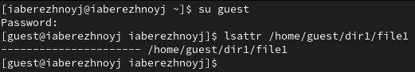
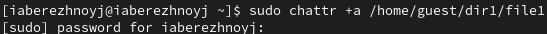
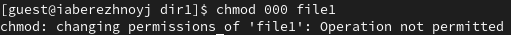
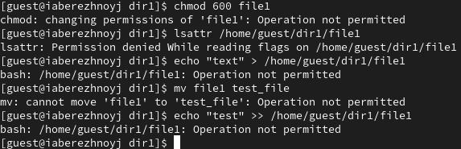

---
## Front matter
lang: ru-RU
title: Презентация по лабораторной работе №4
subtitle: Основы информационной безопасности
author:
  - Бережной И. А.
institute:
  - Российский университет дружбы народов, Москва, Россия

## i18n babel
babel-lang: russian
babel-otherlangs: english

## Formatting pdf
toc: false
toc-title: Содержание
slide_level: 2
aspectratio: 169
section-titles: true
theme: metropolis
header-includes:
 - \metroset{progressbar=frametitle,sectionpage=progressbar,numbering=fraction}
---

# Информация

## Докладчик

:::::::::::::: {.columns align=center}
::: {.column width="70%"}

  * Бережной Иван Александрович
  * студент 2-ого курса
  * Российский университет дружбы народов
  * [1132236041@pfur.ru](mailto:1132236041@pfur.ru)

:::
::::::::::::::

## Цель

Получить практические навыки работы в консоли с расширенными атрибутами файлов.

## Задачи

1. Проверка расширенного атрибута `a`
2. Проверка расширенного атрибута `i`
	
# Выполнение лабораторной работы

## Права файла
Зайдём в терминал от имени пользователя guest и определим расширенные атрибуты файла dir1/file1. Как видим, прав нет. Установим на файл file1 права на чтение, запись для владельца файла командой `chmod 600 dir1/file1`

{#fig:001 width=70%}

## Расширенный атрибут `a`
Установим на упомянутый файл расширенный атрибут `a` от имени guest. Получили ошибку. Попробуем повторить действие от имени другого пользователя с правами администратора. Получилось.

{#fig:002 width=70%}

## Проверка возможностей `a`
Попробуем стереть имеющуюся информацию в файле - неудача. Попробуем переименовать файл - также безуспешно. И, наконец, попробуем изменить права доступа к файлу. Впрочем, ничего неожиданного.

{#fig:003 width=70%}

## Проверка возможностей `i`
Выдадим расширенный атрибут `i`, как это было с `a`, и повторим проделанные действия. Ничего не работает.

{#fig:004 width=70%}

## Вывод

В результате выполнения работы мы повысили свои навыки использования интерфейса командой строки (CLI), познакомились на примерах с тем, как используются основные и расширенные атрибуты при разграничении доступа. Имели возможность связать теорию дискреционного разделения доступа (дискреционная политика безопасности) с её реализацией на практике в ОС Linux. Составили наглядные таблицы, поясняющие какие операции возможны при тех или иных установленных правах. Опробовали действие на практике расширенных атрибутов «а» и «i».

## Список литературы

[1] Основы информационной безопасности, РУДН: https://esystem.rudn.ru/pluginfile.php/2580596/mod_resource/content/3/004-lab_discret_extattr.pdf
