---
## Front matter
title: "Отчёт по лабораторной работе №4"
subtitle: "Основы информационной безопасности"
author: "Бережной Иван Александрович"

## Generic otions
lang: ru-RU
toc-title: "Содержание"

## Bibliography
bibliography: bib/cite.bib
csl: pandoc/csl/gost-r-7-0-5-2008-numeric.csl

## Pdf output format
toc: true # Table of contents
toc-depth: 2
lof: true # List of figures
fontsize: 12pt
linestretch: 1.5
papersize: a4
documentclass: scrreprt
## I18n polyglossia
polyglossia-lang:
  name: russian
  options:
	- spelling=modern
	- babelshorthands=true
polyglossia-otherlangs:
  name: english
## I18n babel
babel-lang: russian
babel-otherlangs: english
## Fonts
mainfont: IBM Plex Serif
romanfont: IBM Plex Serif
sansfont: IBM Plex Sans
monofont: IBM Plex Mono
mainfontoptions: Ligatures=Common,Ligatures=TeX,Scale=0.94
romanfontoptions: Ligatures=Common,Ligatures=TeX,Scale=0.94
sansfontoptions: Ligatures=Common,Ligatures=TeX,Scale=MatchLowercase,Scale=0.94
monofontoptions: Scale=MatchLowercase,Scale=0.94,FakeStretch=0.9
mathfontoptions:
## Biblatex
biblatex: true
biblio-style: "gost-numeric"
biblatexoptions:
  - parentracker=true
  - backend=biber
  - hyperref=auto
  - language=auto
  - autolang=other*
  - citestyle=gost-numeric
## Pandoc-crossref LaTeX customization
figureTitle: "Рис."
tableTitle: "Таблица"
listingTitle: "Листинг"
lofTitle: "Список иллюстраций"
lotTittle: "Список таблиц"
lolTitle: "Листинги"
## Misc options
indent: true
header-includes:
  - \usepackage{indentfirst}
  - \usepackage{float} # keep figures where there are in the text
  - \floatplacement{figure}{H} # keep figures where there are in the text
---

# Цель работы

Получить практические навыки работы в консоли с расширенными атрибутами файлов.

# Задание

1. Проверка расширенного атрибута `a`
2. Проверка расширенного атрибута `i`

# Теоретическое введение

1. Типы прав доступа
	1.1. Чтение (r): Разрешает просмотр содержимого файла или списка файлов в каталоге.

	1.2. Запись (w): Разрешает изменение содержимого файла или создание/удаление файлов в каталоге.

	1.3. Выполнение (x): Разрешает выполнение файла как программы или вход в каталог.

2. Категории пользователей
	- Владелец (Owner): Пользователь, который создал файл или каталог.

	- Группа (Group): Набор пользователей, которые имеют общие права доступа к файлу или каталогу.

	- Остальные (Others): Все остальные пользователи, не являющиеся владельцем или членом группы.

3. Представление прав доступа
Права доступа отображаются в виде символов или цифр:

Символьное представление: rwxr-xr--

Первые три символа (rwx) — права владельца.

Следующие три (r-x) — права группы.

Последние три (r--) — права остальных.

Цифровое представление: Каждое право имеет числовое значение:

r = 4

w = 2

x = 1
Например, rwxr-xr-- в цифровом виде: 754.

4. Команды для управления правами доступа
chmod: Изменяет права доступа.

Пример: chmod 755 file.txt — устанавливает права rwxr-xr-x.

chown: Изменяет владельца файла или каталога.

Пример: chown user:group file.txt — изменяет владельца и группу.

chgrp: Изменяет группу файла или каталога.

Пример: chgrp group file.txt.

5. Особые права доступа
SUID (Set User ID): Если установлен для файла, он выполняется с правами владельца.

SGID (Set Group ID): Если установлен для файла, он выполняется с правами группы. Для каталога — новые файлы наследуют группу каталога.

Sticky Bit: Если установлен для каталога, только владелец файла может удалить или переименовать файл в этом каталоге.

# Выполнение лабораторной работы

## Проверка расширенного атрибута `a`
Зайдём в терминал от имени пользователя guest и определим расширенные атрибуты файла dir1/file1 (рис. [-@fig:001]). Как видим, прав нет. Установим на файл file1 права на чтение, запись для владельца файла командой `chmod 600 dir1/file1` (рис. [-@fig:002]).

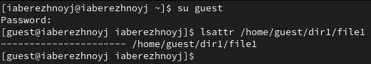{#fig:001 width=70%}

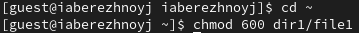{#fig:002 width=70%}

Установим на упомянутый файл расширенный атрибут `a` от имени guest. Получили ошибку (рис. [-@fig:003]). Попробуем повторить действие от имени другого пользователя с правами администратора (рис. [-@fig:004]). Получилось.

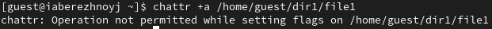{#fig:003 width=70%}

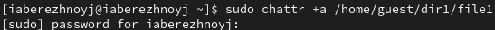{#fig:004 width=70%}

От имени пользователя guest проверим правильность установления атрибута (рис. [-@fig:005]).

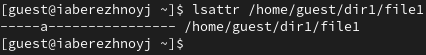{#fig:005 width=70%}

Выполним дозапись текста в файл file1 (рис. [-@fig:006]). Работает.

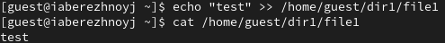{#fig:006 width=70%}

Попробуем стереть имеющуюся информацию в файле - неудача (рис. [-@fig:007]). Попробуем переименовать файл - также безуспешно (рис. [-@fig:008]). И, наконец, попробуем изменить права доступа к файлу. Впрочем, ничего неожиданного (рис. [-@fig:009]).

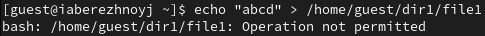{#fig:007 width=70%}

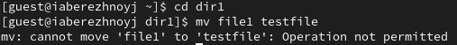{#fig:008 width=70%}

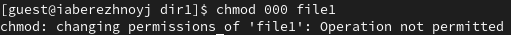{#fig:009 width=70%}

Снимем расширенный атрибут с помощью администратора (рис. [-@fig:010]). Попробуем повторить неудавшиеся действия. Всё получилось (рис. [-@fig:011]).

{#fig:010 width=70%}

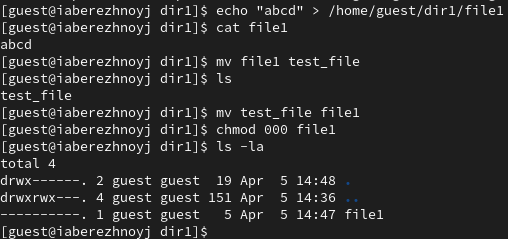{#fig:011 width=70%}

## Проверка расширенного атрибута `i`

Выдадим расширенный атрибут `i`, как это было с `a` (рис. [-@fig:012]) и повторим проделанные действия (рис. [-@fig:013]). Ничего не работает.

{#fig:012 width=70%}

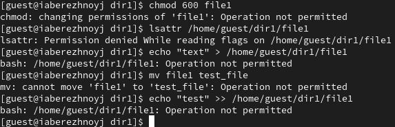{#fig:013 width=70%}

# Выводы

В результате выполнения работы мы повысили свои навыки использования интерфейса командой строки (CLI), познакомились на примерах с тем, как используются основные и расширенные атрибуты при разграничении доступа. Имели возможность связать теорию дискреционного разделения доступа (дискреционная политика безопасности) с её реализацией на практике в ОС Linux. Составили наглядные таблицы, поясняющие какие операции возможны при тех или иных установленных правах. Опробовали действие на практике расширенных атрибутов «а» и «i».
