---
## Front matter
title: "Отчёт по лабораторной работе №5"
subtitle: "Основы информационной безопасности"
author: "Бережной Иван Александрович"

## Generic otions
lang: ru-RU
toc-title: "Содержание"

## Bibliography
bibliography: bib/cite.bib
csl: pandoc/csl/gost-r-7-0-5-2008-numeric.csl

## Pdf output format
toc: true # Table of contents
toc-depth: 2
lof: true # List of figures
fontsize: 12pt
linestretch: 1.5
papersize: a4
documentclass: scrreprt
## I18n polyglossia
polyglossia-lang:
  name: russian
  options:
	- spelling=modern
	- babelshorthands=true
polyglossia-otherlangs:
  name: english
## I18n babel
babel-lang: russian
babel-otherlangs: english
## Fonts
mainfont: IBM Plex Serif
romanfont: IBM Plex Serif
sansfont: IBM Plex Sans
monofont: IBM Plex Mono
mainfontoptions: Ligatures=Common,Ligatures=TeX,Scale=0.94
romanfontoptions: Ligatures=Common,Ligatures=TeX,Scale=0.94
sansfontoptions: Ligatures=Common,Ligatures=TeX,Scale=MatchLowercase,Scale=0.94
monofontoptions: Scale=MatchLowercase,Scale=0.94,FakeStretch=0.9
mathfontoptions:
## Biblatex
biblatex: true
biblio-style: "gost-numeric"
biblatexoptions:
  - parentracker=true
  - backend=biber
  - hyperref=auto
  - language=auto
  - autolang=other*
  - citestyle=gost-numeric
## Pandoc-crossref LaTeX customization
figureTitle: "Рис."
tableTitle: "Таблица"
listingTitle: "Листинг"
lofTitle: "Список иллюстраций"
lotTittle: "Список таблиц"
lolTitle: "Листинги"
## Misc options
indent: true
header-includes:
  - \usepackage{indentfirst}
  - \usepackage{float} # keep figures where there are in the text
  - \floatplacement{figure}{H} # keep figures where there are in the text
---

# Цель работы

Изученить механизмы изменения идентификаторов, применения SetUID- и Sticky-битов. Получить практические навыки работы в консоли с дополнительными атрибутами. Рассмотреть работы механизма смены идентификатора процессов пользователей, а также влияние бита Sticky на запись и удаление файлов.

# Задание

1. Создать программы
2. Исследовать Sticky-бит

# Теоретическое введение

1. Дополнительные атрибуты файлов Linux

В Linux существует три основных вида прав — право на чтение (read), запись (write) и выполнение (execute), а также три категории пользователей, к которым они могут применяться — владелец файла (user), группа владельца (group) и все остальные (others). Но, кроме прав чтения, выполнения и записи, есть еще три дополнительных атрибута. [@u]

**Sticky bit**

Используется в основном для каталогов, чтобы защитить в них файлы. В такой каталог может писать любой пользователь. Но, из такой директории пользователь может удалить только те файлы, владельцем которых он является. Примером может служить директория /tmp, в которой запись открыта для всех пользователей, но нежелательно удаление чужих файлов.

**SUID (Set User ID)**

Атрибут исполняемого файла, позволяющий запустить его с правами владельца. В Linux приложение запускается с правами пользователя, запустившего указанное приложение. Это обеспечивает дополнительную безопасность т.к. процесс с правами пользователя не сможет получить доступ к важным системным файлам, которые принадлежат пользователю root.

**SGID (Set Group ID)**

Аналогичен suid, но относиться к группе. Если установить sgid для каталога, то все файлы созданные в нем, при запуске будут принимать идентификатор группы каталога, а не группы владельца, который создал файл в этом каталоге.

**Обозначение атрибутов sticky, suid, sgid**

Специальные права используются довольно редко, поэтому при выводе программы ls -l символ, обозначающий указанные атрибуты, закрывает символ стандартных прав доступа.

Пример:
`rwsrwsrwt`

где первая s — это suid, вторая s — это sgid, а последняя t — это sticky bit

В приведенном примере не понятно, rwt — это rw- или rwx? Определить это просто. Если t маленькое, значит x установлен. Если T большое, значит x не установлен. То же самое правило распространяется и на s.

В числовом эквиваленте данные атрибуты определяются первым символом при четырехзначном обозначении (который часто опускается при назначении прав), например в правах 1777 — символ 1 обозначает sticky bit. Остальные атрибуты имеют следующие числовое соответствие:

```
1 — установлен sticky bit
2 — установлен sgid
4 — установлен suid
```

2. Компилятор GCC

GСС - это свободно доступный оптимизирующий компилятор для языков C, C++. Собственно программа gcc это некоторая надстройка над группой компиляторов, которая способна анализировать имена файлов, передаваемые ей в качестве аргументов, и определять, какие действия необходимо выполнить. Файлы с расширением .cc или .C рассматриваются, как файлы на языке C++, файлы с расширением .c как программы на языке C, а файлы c расширением .o считаются объектными [@gcc].

# Выполнение лабораторной работы

## Создание программ
Войдём в систему от имени пользователя guest (рис. [-@fig:001]) и создадим программу `simpleid.c` (рис. [-@fig:002] и рис. [-@fig:003]). 

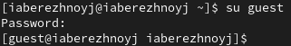{#fig:001 width=70%}

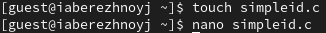{#fig:002 width=70%}

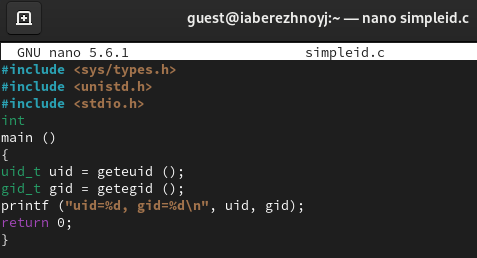{#fig:003 width=70%}

Листинг 1:
```c++
#include <sys/types.h>
#include <unistd.h>
#include <stdio.h>
int
main ()
{
uid_t uid = geteuid ();
gid_t gid = getegid ();
printf ("uid=%d, gid=%d\n", uid, gid);
return 0;
}
```

Скомпилируем программу и убедимся, что файл создан (рис. [-@fig:004]). Выполним программу, а также команду `id`, и сравним результаты (рис. [-@fig:005]). Как видно, встроенная команда даёт больше информации.

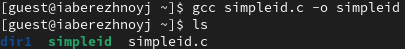{#fig:004 width=70%}

{#fig:005 width=70%}

Усовершенствуем нашу программу, добавив вывод действительных идентификаторов (рис. [-@fig:006]).

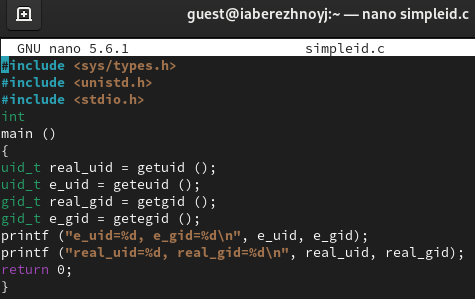{#fig:006 width=70%}

Листинг 2:
```c++
#include <sys/types.h>
#include <unistd.h>
#include <stdio.h>
int
main ()
{
uid_t real_uid = getuid ();
uid_t e_uid = geteuid ();
gid_t real_gid = getgid ();
gid_t e_gid = getegid () ;
printf ("e_uid=%d, e_gid=%d\n", e_uid, e_gid);
printf ("real_uid=%d, real_gid=%d\n", real_uid, real_gid);
return 0;
```

Скомпилируем и запустим новую программу (рис. [-@fig:007]).

{#fig:007 width=70%}

От имени суперпользователя меняем владельца файла на суперпользователя и меняем права с помощью `chmod` (рис. [-@fig:008]). Проверим правильность установки атрибутов (рис. [-@fig:009]).

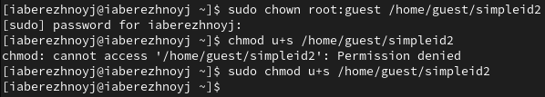{#fig:008 width=70%}

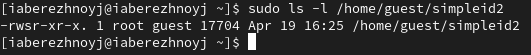{#fig:009 width=70%}

Запустим `simpleid2` и `id`. Собственная команда выводит всё ещё ограниченное количество информации (рис. [-@fig:010]).

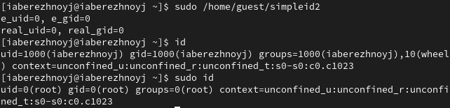{#fig:010 width=70%}

Создадим программу `readfile.c` (рис. [-@fig:011] и рис. [-@fig:012]).

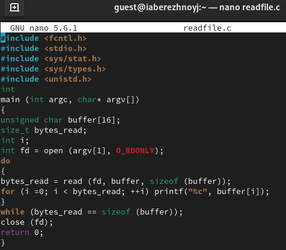{#fig:011 width=70%}

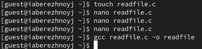{#fig:012 width=70%}

Листинг 3:
```c++
#include <fcntl.h>
#include <stdio.h>
#include <sys/stat.h>
#include <sys/types.h>
#include <unistd.h>
int
main (int argc, char* argv[])
{
unsigned char buffer[16];
size_t bytes_read;
int i;
int fd = open (argv[1], O_RDONLY);
do
{
bytes_read = read (fd, buffer, sizeof (buffer));
for (i =0; i < bytes_read; ++i) printf("%c", buffer[i]);
}
while (bytes_read == sizeof (buffer));
close (fd);
ret
```

Сменим владельца у файла `readfile.c` и изменим права так, чтобы только суперпользователь смог его прочитать (рис. [-@fig:013]).

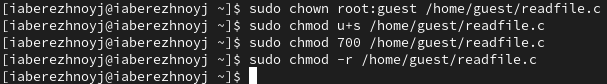{#fig:013 width=70%}

Попробуем прочитать файл от имени `guest`. Получили ошибку (рис. [-@fig:014]). Попытки прочитать файл другими путями также не увенчались успехом (рис. [-@fig:015]).

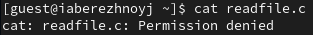{#fig:014 width=70%}

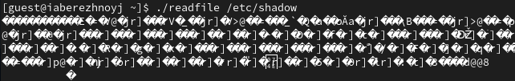{#fig:015 width=70%}

## Исследование Sticky-бита
Посмотрим, установлен ли атрибует Sticky на директории /tmp (рис. [-@fig:016]). В выводе присутствует буква `t`, значит, установлен.

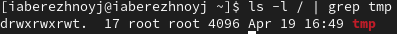{#fig:016 width=70%}

От имени пользователя guest создадим фалй `file01.txt` в директории /tmp, разрешим чтение и запись для остальных польователей (рис. [-@fig:017]). Теперь от имени пользователя guest2 попробуем прочитать файл (успешно) и дописать что-либо в него (ошибка доступа). Также не получается удалить файл (рис. [-@fig:018]).

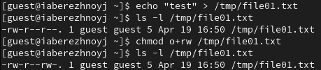{#fig:017 width=70%}

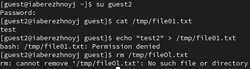{#fig:018 width=70%}

Повысим права до суперпользователя и снимем атрибут `t` с файла (рис. [-@fig:019]). Снова от имени пользователя guest2 повторим попытку выполнить команды. Кроме того, что получилось удалить файл, ничего не поменялось.

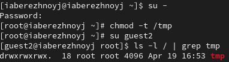{#fig:019 width=70%}

Вернём атрибут (рис. [-@fig:020]).

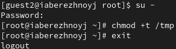{#fig:020 width=70%}


# Выводы

В результате выполнения работы мы изучили механизмы изменения идентификаторов, применения SetUID- и Sticky-битов. Получили практические навыки работы в консоли с дополнительными атрибутами. Рассмотрели работы механизма смены идентификатора процессов пользователей, а также влияние бита Sticky на запись и удаление файлов.
