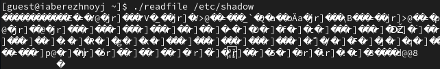
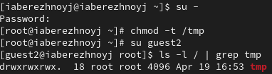

---
## Front matter
lang: ru-RU
title: Презентация по лабораторной работе №8
subtitle: Основы информационной безопасности
author:
  - Бережной И. А.
institute:
  - Российский университет дружбы народов, Москва, Россия

## i18n babel
babel-lang: russian
babel-otherlangs: english

## Formatting pdf
toc: false
toc-title: Содержание
slide_level: 2
aspectratio: 169
section-titles: true
theme: metropolis
header-includes:
 - \metroset{progressbar=frametitle,sectionpage=progressbar,numbering=fraction}
---

# Информация

## Докладчик

:::::::::::::: {.columns align=center}
::: {.column width="70%"}

  * Бережной Иван Александрович
  * студент 2-ого курса
  * Российский университет дружбы народов
  * [1132236041@pfur.ru](mailto:1132236041@pfur.ru)

:::
::::::::::::::

## Цель

Изученить механизмы изменения идентификаторов, применения SetUID- и Sticky-битов. Получить практические навыки работы в консоли с дополнительными атрибутами. Рассмотреть работы механизма смены идентификатора процессов пользователей, а также влияние бита Sticky на запись и удаление файлов.

## Задачи

1. Создать программы
2. Исследовать Sticky-бит
	
# Выполнение лабораторной работы

## Выполнение лабораторной работы
Войдём в систему от имени пользователя guest и создадим программу `simpleid.c`. Скомпилируем программу и убедимся, что файл создан. Выполним программу, а также команду `id`, и сравним результаты.

{#fig:001 width=70%}

## Выполнение лабораторной работы
Усовершенствуем нашу программу, добавив вывод действительных идентификаторов. Скомпилируем и запустим новую программу. От имени суперпользователя меняем владельца файла на суперпользователя и меняем права с помощью `chmod`. Проверим правильность установки атрибутов.

{#fig:002 width=70%}

## Выполнение лабораторной работы
Запустим `simpleid2` и `id`. Собственная команда выводит всё ещё ограниченное количество информации.

{#fig:003 width=70%}

## Выполнение лабораторной работы
Создадим программу `readfile.c`. Сменим владельца у файла `readfile.c` и изменим права так, чтобы только суперпользователь смог его прочитать. Попробуем прочитать файл от имени `guest`. Получили ошибку. Попытки прочитать файл другими путями также не увенчались успехом.

{#fig:004 width=70%}

## Выполнение лабораторной работы
Посмотрим, установлен ли атрибует Sticky на директории /tmp. В выводе присутствует буква `t`, значит, установлен.

{#fig:005 width=70%}

## Выполнение лабораторной работы
От имени пользователя guest создадим фалй `file01.txt` в директории /tmp, разрешим чтение и запись для остальных польователей. Теперь от имени пользователя guest2 попробуем прочитать файл (успешно) и дописать что-либо в него (ошибка доступа). Также не получается удалить файл.

{#fig:006 width=70%}

## Выполнение лабораторной работы
Повысим права до суперпользователя и снимем атрибут `t` с файла. Снова от имени пользователя guest2 повторим попытку выполнить команды. Кроме того, что получилось удалить файл, ничего не поменялось. Вернём атрибут.

{#fig:007 width=70%}

## Вывод

В результате выполнения работы мы изучили механизмы изменения идентификаторов, применения SetUID- и Sticky-битов. Получили практические навыки работы в консоли с дополнительными атрибутами. Рассмотрели работы механизма смены идентификатора процессов пользователей, а также влияние бита Sticky на запись и удаление файлов.

## Список литературы

[1] Основы информационной безопасности, РУДН: https://esystem.rudn.ru/mod/resource/view.php?id=1220153
