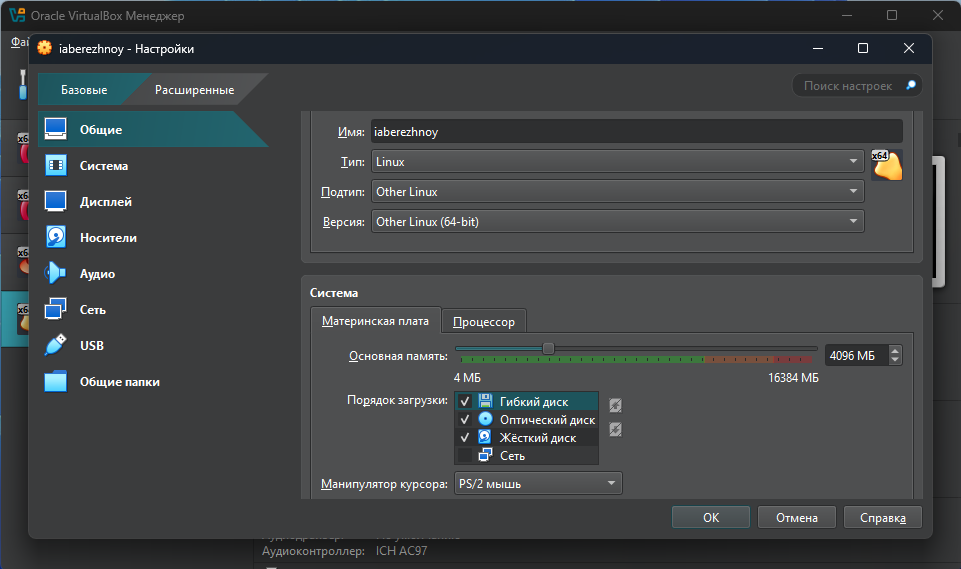
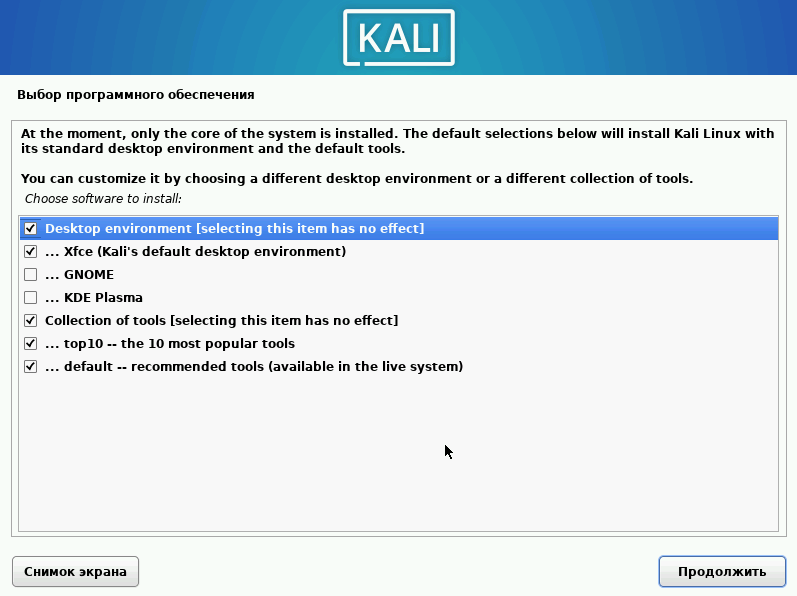
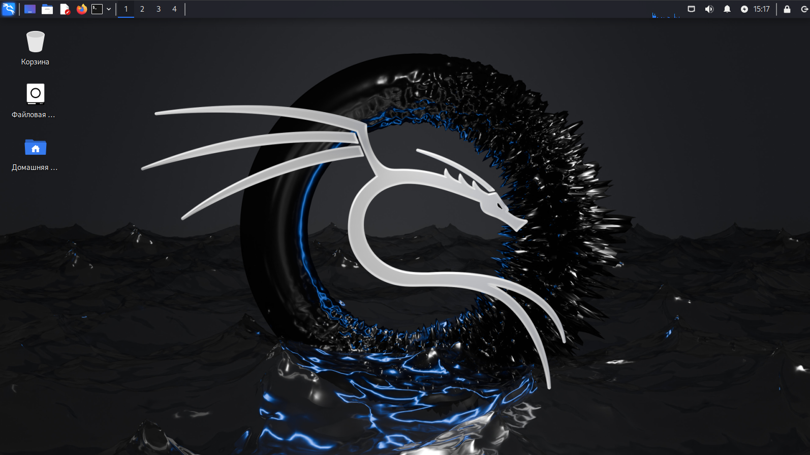

---
## Front matter
lang: ru-RU
title: Презентация по 1-ому этапу индивидуального проекта
subtitle: Основы информационной безопасности
author:
  - Бережной И. А.
institute:
  - Российский университет дружбы народов, Москва, Россия

## i18n babel
babel-lang: russian
babel-otherlangs: english

## Formatting pdf
toc: false
toc-title: Содержание
slide_level: 2
aspectratio: 169
section-titles: true
theme: metropolis
header-includes:
 - \metroset{progressbar=frametitle,sectionpage=progressbar,numbering=fraction}
---

# Информация

## Докладчик

:::::::::::::: {.columns align=center}
::: {.column width="70%"}

  * Бережной Иван Александрович
  * студент 2-ого курса
  * Российский университет дружбы народов
  * [1132236041@pfur.ru](mailto:1132236041@pfur.ru)

:::
::::::::::::::

## Цель

Попрактиковать навыки установки дистрибутивов Linux на виртуальную машину.

## Задачи

Установить Kali Linux на виртуальную машину VirtualBox.
	
# Выполнение лабораторной работы

## Выполнение лабораторной работы

Откроем VirtualBox, создадим в нём виртуальную машину и настроем её. Настройки выберем следующие: RAM - 4gb, CPU - 4 cores, ROM - 45gb. 

{#fig:001 width=70%}

## Выполнение лабораторной работы

Запускаем машину, нас встречает установщик ОС. Языком системы выберем русский, но клавиатуру поставим английскую. В качестве имени компьютера введём логин для входа учётной записи в компьютерных классах РУДН. Также впишем имя домена, согласно шаблону : <username>.localdomain.

{#fig:005 width=70%}

## Выполнение лабораторной работы

Создадим пользователя и учётную запись. Для начала впишем некий никнейм, после - имя пользователя и пароль для него. Выберем нужный часовой пояс и настроем диски. 

{#fig:013 width=70%}

## Выполнение лабораторной работы

Выберем дополнительное ПО. Я оставлю по умолчанию. 

{#fig:014 width=70%}

## Выполнение лабораторной работы

Установим системный загрузчик GRUB. После завершения установки убедимся, что оптический привод виртуалной машины стал пуст. После этого перезагрузим ОС.

{#fig:018 width=70%}

## Вывод

В ходе выполнения этапа проекта мы потренировались устанавливать ОС на виртуальную машину.
