---
## Front matter
title: "Отчёт по 1-ому этапу индивидуального проекта"
subtitle: "Основы информационной безопасности"
author: "Бережной Иван Александрович"

## Generic otions
lang: ru-RU
toc-title: "Содержание"

## Bibliography
bibliography: bib/cite.bib
csl: pandoc/csl/gost-r-7-0-5-2008-numeric.csl

## Pdf output format
toc: true # Table of contents
toc-depth: 2
lof: true # List of figures
fontsize: 12pt
linestretch: 1.5
papersize: a4
documentclass: scrreprt
## I18n polyglossia
polyglossia-lang:
  name: russian
  options:
	- spelling=modern
	- babelshorthands=true
polyglossia-otherlangs:
  name: english
## I18n babel
babel-lang: russian
babel-otherlangs: english
## Fonts
mainfont: IBM Plex Serif
romanfont: IBM Plex Serif
sansfont: IBM Plex Sans
monofont: IBM Plex Mono
mainfontoptions: Ligatures=Common,Ligatures=TeX,Scale=0.94
romanfontoptions: Ligatures=Common,Ligatures=TeX,Scale=0.94
sansfontoptions: Ligatures=Common,Ligatures=TeX,Scale=MatchLowercase,Scale=0.94
monofontoptions: Scale=MatchLowercase,Scale=0.94,FakeStretch=0.9
mathfontoptions:
## Biblatex
biblatex: true
biblio-style: "gost-numeric"
biblatexoptions:
  - parentracker=true
  - backend=biber
  - hyperref=auto
  - language=auto
  - autolang=other*
  - citestyle=gost-numeric
## Pandoc-crossref LaTeX customization
figureTitle: "Рис."
tableTitle: "Таблица"
listingTitle: "Листинг"
lofTitle: "Список иллюстраций"
lotTittle: "Список таблиц"
lolTitle: "Листинги"
## Misc options
indent: true
header-includes:
  - \usepackage{indentfirst}
  - \usepackage{float} # keep figures where there are in the text
  - \floatplacement{figure}{H} # keep figures where there are in the text
---

# Цель работы

Попрактиковать навыки установки дистрибутивов Linux на виртуальную машину.

# Задание

Установить Kali Linux на виртуальную машину VirtualBox.

# Выполнение лабораторной работы

Откроем VirtualBox, создадим в нём виртуальную машину и настроем её. Настройки выберем следующие: RAM - 4gb, CPU - 4 cores, ROM - 45gb (рис. [-@fig:001]).

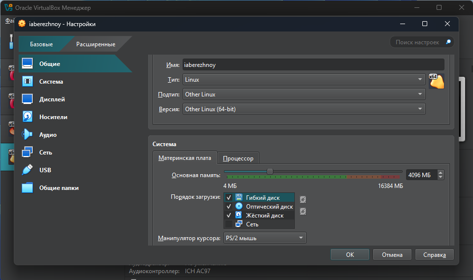{#fig:001 width=70%}

Запускаем машину, нас встречает установщик ОС (рис. [-@fig:002]). Языком системы выберем русский (рис. [-@fig:003]), но клавиатуру поставим английскую (рис. [-@fig:004]).

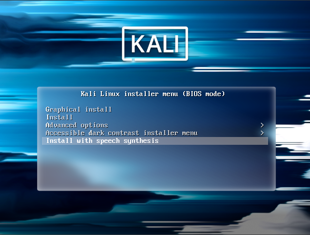{#fig:002 width=70%}

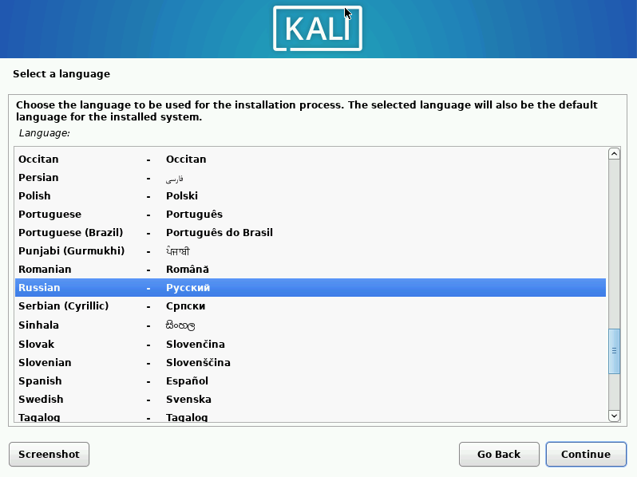{#fig:003 width=70%}

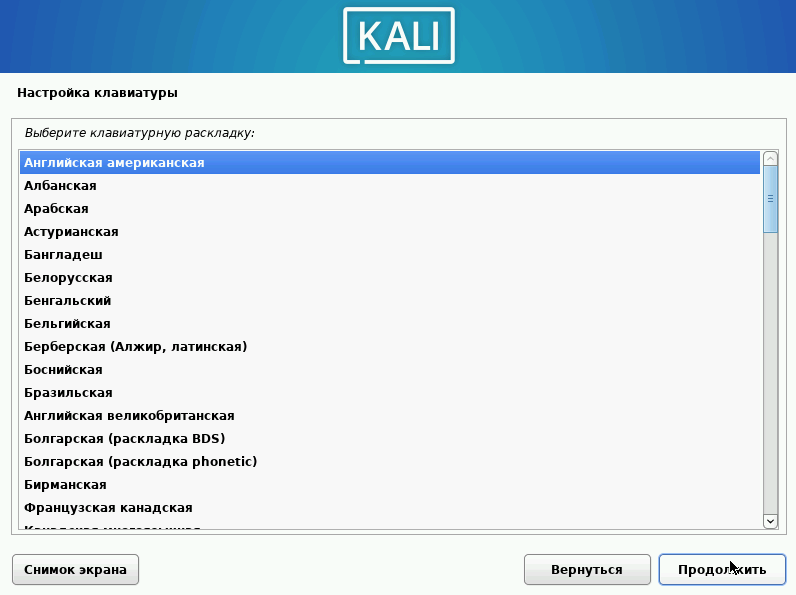{#fig:004 width=70%}

В качестве имени компьютера введём логин для входа учётной записи в компьютерных классах РУДН (рис. [-@fig:005]). Также впишем имя домена, согласно шаблону : <username>.localdomain (рис. [-@fig:006]).

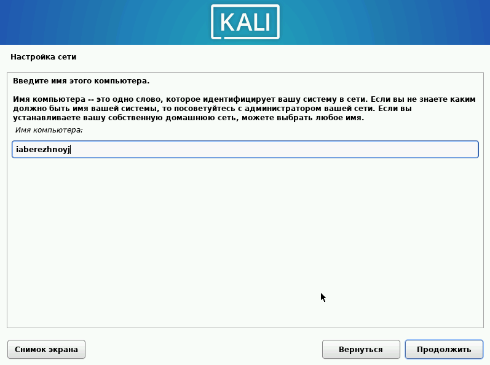{#fig:005 width=70%}

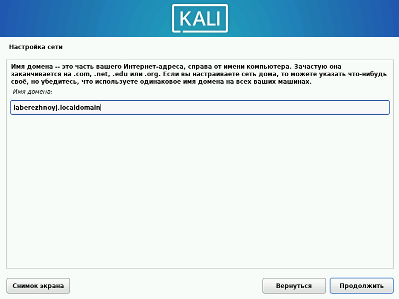{#fig:006 width=70%}

Создадим пользователя и учётную запись. Для начала впишем некий никнейм (рис. [-@fig:007]), после - имя пользователя (рис. [-@fig:008]) и пароль для него (рис. [-@fig:009]).

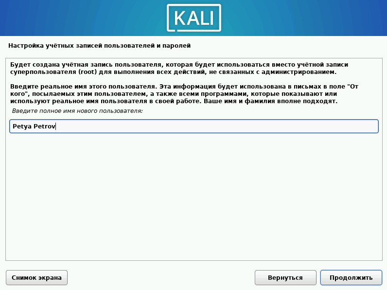{#fig:007 width=70%}

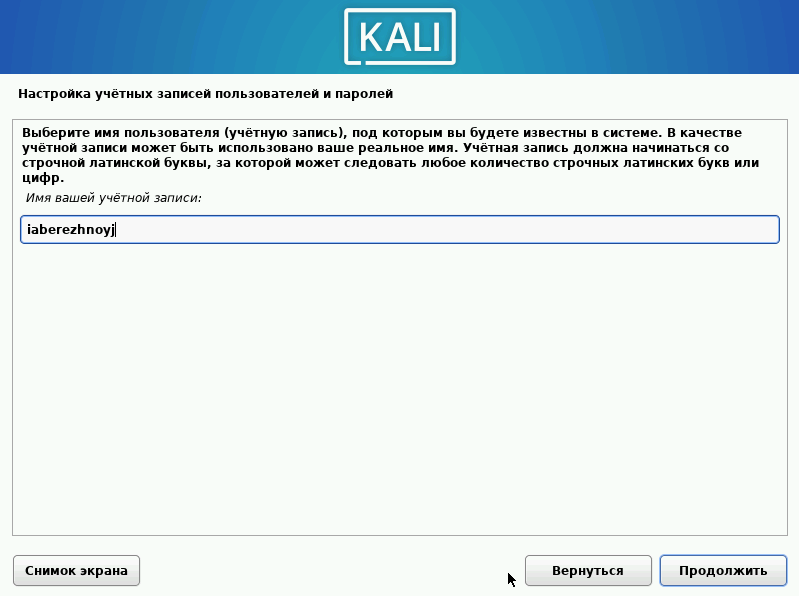{#fig:008 width=70%}

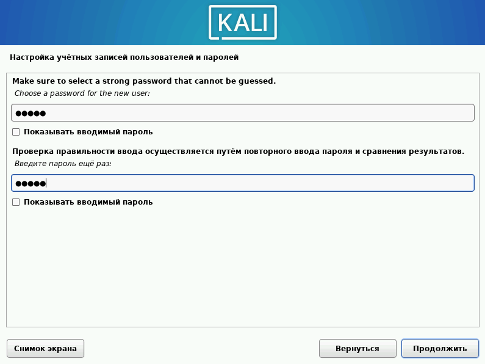{#fig:009 width=70%}

Выберем нужный часовой пояс (рис. [-@fig:010]). 

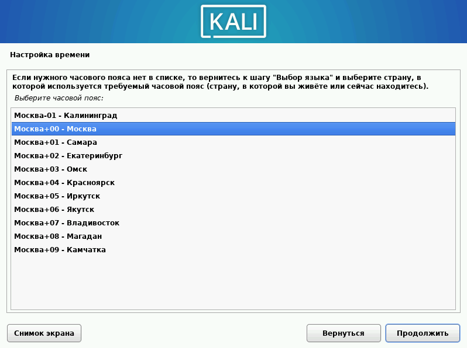{#fig:010 width=70%}

Настроим диски. В следующем окне выберем "Авто" (рис. [-@fig:011]). Раздел сделаем общим (рис. [-@fig:012]) и подтверждаем (рис. [-@fig:013]).

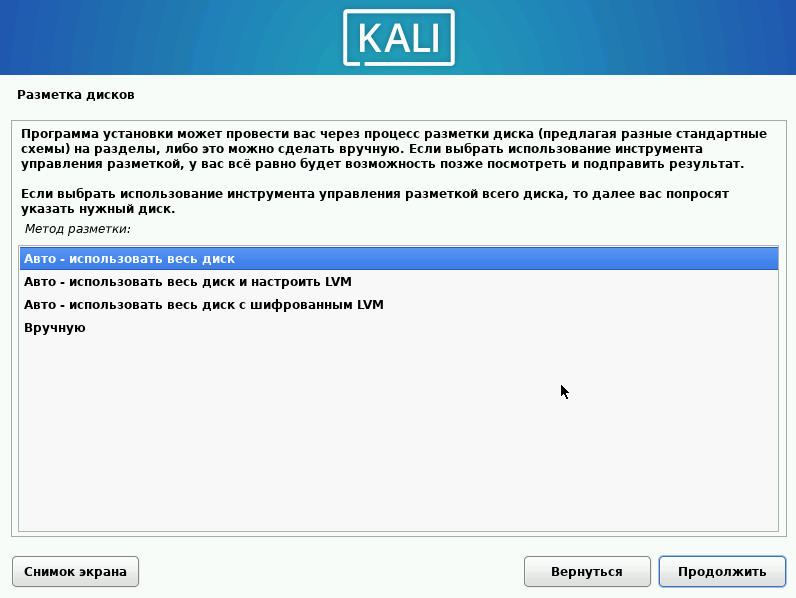{#fig:011 width=70%}

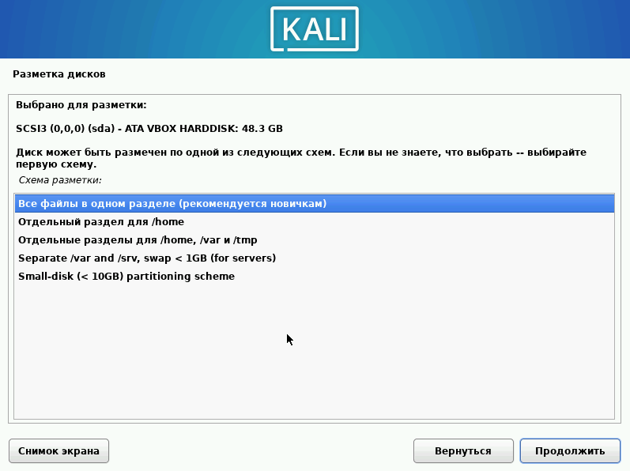{#fig:012 width=70%}

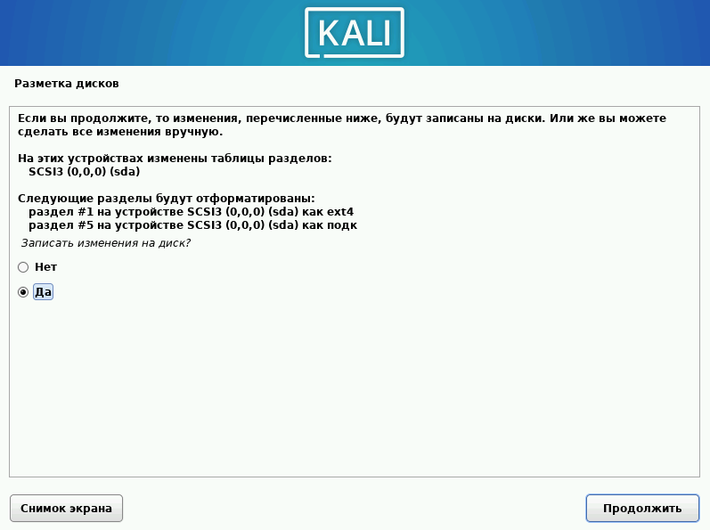{#fig:013 width=70%}

Выберем дополнительное ПО. Я оставлю по умолчанию (рис. [-@fig:014]). 

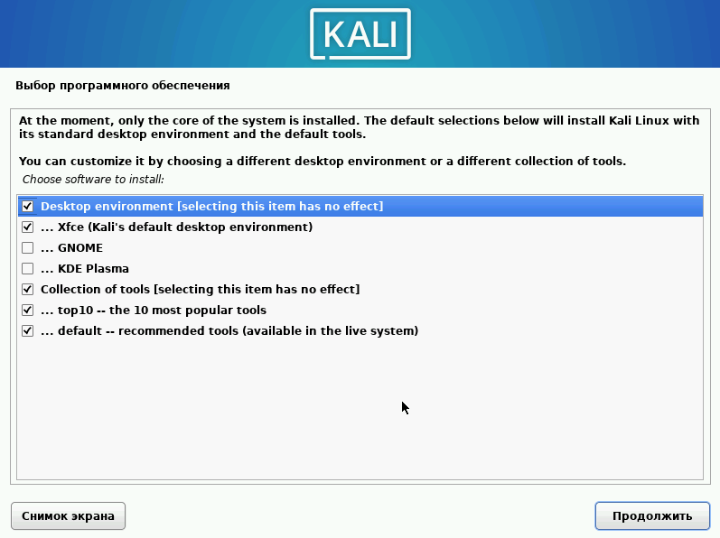{#fig:014 width=70%}

Установим системный загрузчик GRUB (рис. [-@fig:015] и [-@fig:016]).  

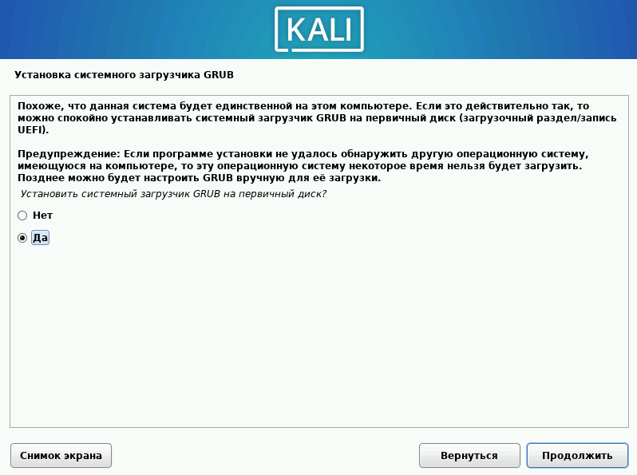{#fig:015 width=70%}

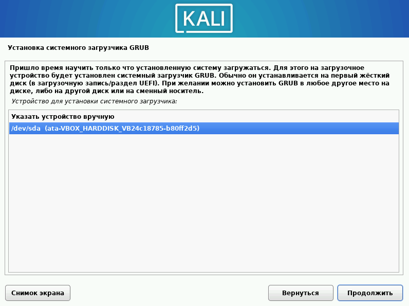{#fig:016 width=70%}

После завершения установки убедимся, что оптический привод виртуалной машины стал пуст. После этого перезагрузим ОС (рис. [-@fig:017]). 

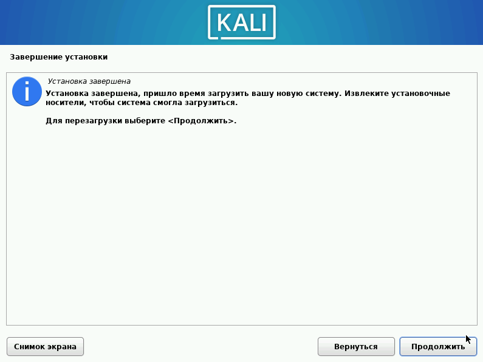{#fig:017 width=70%}

Мы внутри Kali (рис. [-@fig:018]).

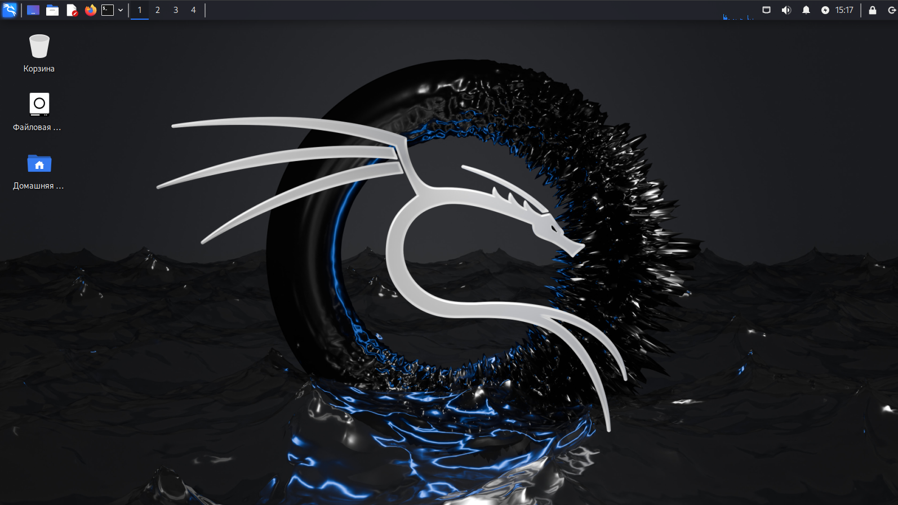{#fig:018 width=70%}

# Выводы

В ходе выполнения этапа проекта мы потренировались устанавливать ОС на виртуальную машину.
