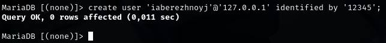

---
## Front matter
lang: ru-RU
title: Презентация по 2-ому этапу индивидуального проекта
subtitle: Основы информационной безопасности
author:
  - Бережной И. А.
institute:
  - Российский университет дружбы народов, Москва, Россия

## i18n babel
babel-lang: russian
babel-otherlangs: english

## Formatting pdf
toc: false
toc-title: Содержание
slide_level: 2
aspectratio: 169
section-titles: true
theme: metropolis
header-includes:
 - \metroset{progressbar=frametitle,sectionpage=progressbar,numbering=fraction}
---

# Информация

## Докладчик

:::::::::::::: {.columns align=center}
::: {.column width="70%"}

  * Бережной Иван Александрович
  * студент 2-ого курса
  * Российский университет дружбы народов
  * [1132236041@pfur.ru](mailto:1132236041@pfur.ru)

:::
::::::::::::::

## Цель

Попрактиковать навыки установки ПО на дистрибутив Linux - Kali.

## Задачи

Установить DVWA на ОС.
	
# Выполнение лабораторной работы

## Выполнение лабораторной работы
Для начала клонируем репозиторий DVWA на локальный хост. Переходим к конфигурации и меняем имя пользователя и пароль.

{#fig:001 width=70%}

## Выполнение лабораторной работы
Запускаем mysql и создаём нового пользователя, попутна выдавая все привилегии.

{#fig:002 width=70%}

## Выполнение лабораторной работы
Переходим в каталог apache и изменяем файл php.ini.

{#fig:003 width=70%}

## Выполнение лабораторной работы
Запускаем apache. Теперь можем открыть DVWA в браузере.

{#fig:004 width=70%}

## Вывод

В ходе выполнения этапа проекта мы потренировались устанавливать ПО на виртуальную машину, а конкретно на дистрибутив Linux - Kali.
