---
## Front matter
title: "Отчёт по 2-ому этапу индивидуального проекта"
subtitle: "Основы информационной безопасности"
author: "Бережной Иван Александрович"

## Generic otions
lang: ru-RU
toc-title: "Содержание"

## Bibliography
bibliography: bib/cite.bib
csl: pandoc/csl/gost-r-7-0-5-2008-numeric.csl

## Pdf output format
toc: true # Table of contents
toc-depth: 2
lof: true # List of figures
fontsize: 12pt
linestretch: 1.5
papersize: a4
documentclass: scrreprt
## I18n polyglossia
polyglossia-lang:
  name: russian
  options:
	- spelling=modern
	- babelshorthands=true
polyglossia-otherlangs:
  name: english
## I18n babel
babel-lang: russian
babel-otherlangs: english
## Fonts
mainfont: IBM Plex Serif
romanfont: IBM Plex Serif
sansfont: IBM Plex Sans
monofont: IBM Plex Mono
mainfontoptions: Ligatures=Common,Ligatures=TeX,Scale=0.94
romanfontoptions: Ligatures=Common,Ligatures=TeX,Scale=0.94
sansfontoptions: Ligatures=Common,Ligatures=TeX,Scale=MatchLowercase,Scale=0.94
monofontoptions: Scale=MatchLowercase,Scale=0.94,FakeStretch=0.9
mathfontoptions:
## Biblatex
biblatex: true
biblio-style: "gost-numeric"
biblatexoptions:
  - parentracker=true
  - backend=biber
  - hyperref=auto
  - language=auto
  - autolang=other*
  - citestyle=gost-numeric
## Pandoc-crossref LaTeX customization
figureTitle: "Рис."
tableTitle: "Таблица"
listingTitle: "Листинг"
lofTitle: "Список иллюстраций"
lotTittle: "Список таблиц"
lolTitle: "Листинги"
## Misc options
indent: true
header-includes:
  - \usepackage{indentfirst}
  - \usepackage{float} # keep figures where there are in the text
  - \floatplacement{figure}{H} # keep figures where there are in the text
---

# Цель работы

Попрактиковать навыки установки ПО на дистрибутив Linux - Kali.

# Задание

Установить DVWA на ОС.

# Теоретическое введение

**DVWA (Damn Vulnerable Web Application)** — это веб-приложение, специально созданное для тестирования на уязвимости и обучения основам веб-безопасности. Оно содержит множество уязвимостей, таких как SQL-инъекции, XSS, CSRF, файловые включения и другие, что позволяет безопасно практиковаться в их эксплуатации и устранении.

## Основные особенности:
- **Цель**: Обучение и тестирование навыков пентеста.
- **Уязвимости**: Включает широкий спектр уязвимостей для изучения.
- **Уровни сложности**: Низкий, средний, высокий и невозможный (для разных уровней подготовки).
- **Простота установки**: Работает на локальном сервере (например, XAMPP, Docker).

## Как использовать:
1. Установите DVWA на локальный сервер или используйте готовый образ Docker.
2. Войдите в систему (по умолчанию логин: `admin`, пароль: `password`).
3. Выберите уровень сложности и начинайте тестирование.

## Примеры уязвимостей:
- **SQL Injection**: Внедрение SQL-кода для получения доступа к базе данных.
- **XSS (Cross-Site Scripting)**: Внедрение вредоносных скриптов в веб-страницы.
- **CSRF (Cross-Site Request Forgery)**: Подделка запросов от имени пользователя.

# Выполнение лабораторной работы

Перейдём в каталог html и клонируем репозиторий git (рис. [-@fig:001]).

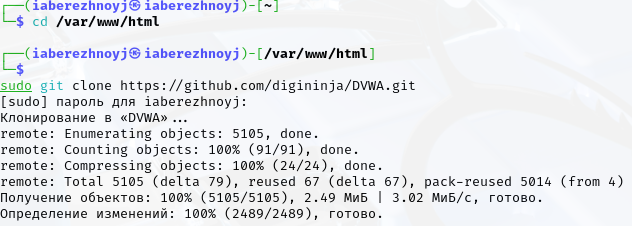{#fig:001 width=70%}

Изменим права доступа к папке установки и перейдём к файлу конфигурации (рис. [-@fig:002]).

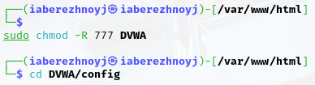{#fig:002 width=70%}

Скопируем файл конфига и переименуем его (рис. [-@fig:003]). Откроем файл конфигурации и изменим имя пользователя и пароль (рис. [-@fig:004]).

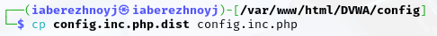{#fig:003 width=70%}

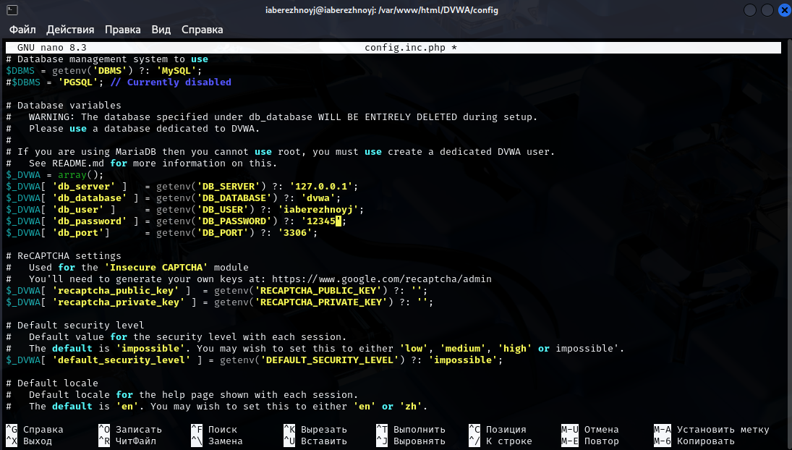{#fig:004 width=70%}

Поскольку mysql уже установлен, запустим его (рис. [-@fig:005]) и войдём в базу данных (рис. [-@fig:006]).

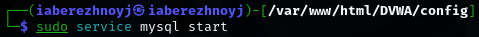{#fig:005 width=70%}

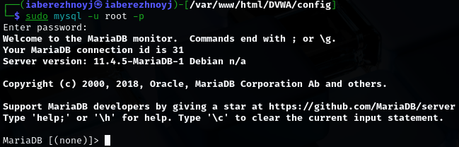{#fig:006 width=70%}

Создадим пользователя базы данных, указав имя и пароль такие же, как в файле конфигурации (рис. [-@fig:007]), а также предоставим этому пользователю все привилегии (рис. [-@fig:008]).

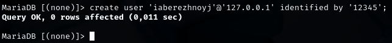{#fig:007 width=70%}

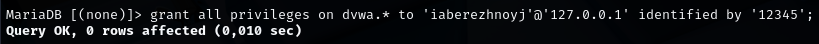{#fig:008 width=70%}

Перейдём в каталог apache (рис. [-@fig:009]) и откроем файл php.ini, чтобы включить параметр `allow_url_include` (рис. [-@fig:010]).

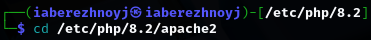{#fig:009 width=70%}

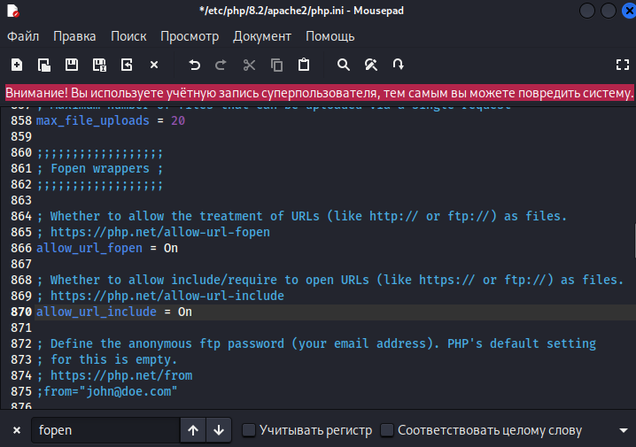{#fig:010 width=70%}

Запустим apache (рис. [-@fig:011]).

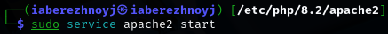{#fig:011 width=70%}

Теперь можем перейти в браузер и открыть DVWA по адресу 127.0.0.1/DVWA/setup.php (рис. [-@fig:012])

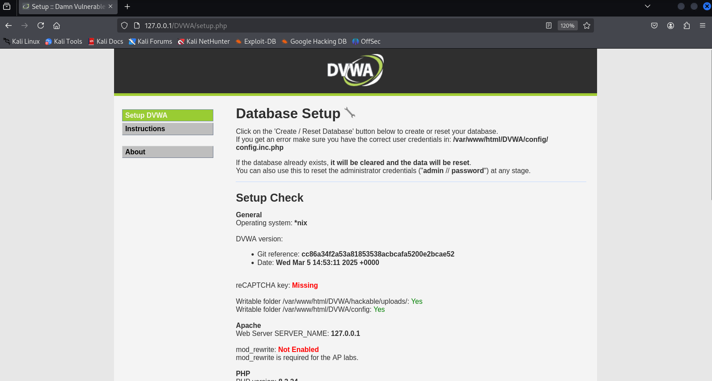{#fig:012 width=70%}

Внизу нажмём Create Database, введём "admin" и "password" в соответствующих строках. Увидим следующую страницу (рис. [-@fig:013])

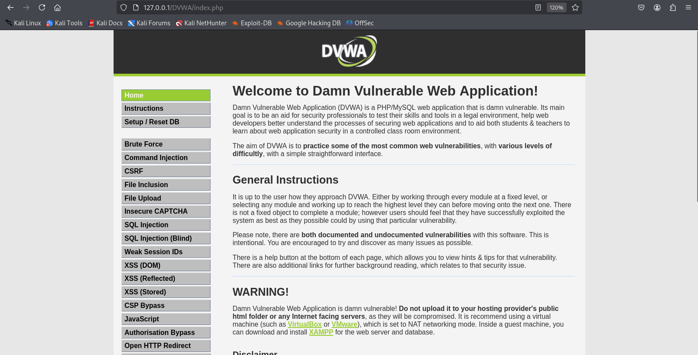{#fig:013 width=70%}

# Выводы

В ходе выполнения этапа проекта мы потренировались устанавливать ПО на виртуальную машину, а конкретно на дистрибутив Linux - Kali.
