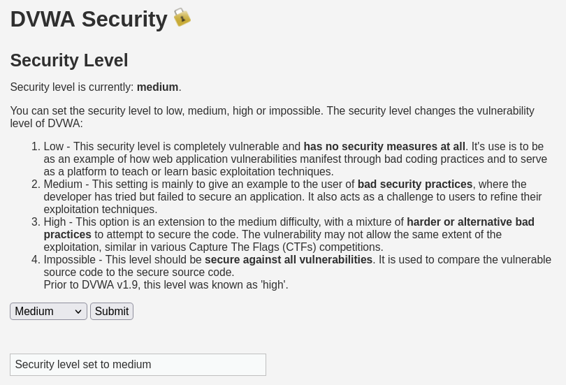
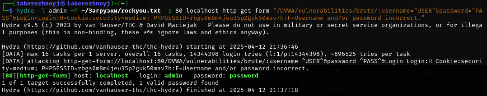

---
## Front matter
lang: ru-RU
title: Презентация по 3-ему этапу индивидуального проекта
subtitle: Основы информационной безопасности
author:
  - Бережной И. А.
institute:
  - Российский университет дружбы народов, Москва, Россия

## i18n babel
babel-lang: russian
babel-otherlangs: english

## Formatting pdf
toc: false
toc-title: Содержание
slide_level: 2
aspectratio: 169
section-titles: true
theme: metropolis
header-includes:
 - \metroset{progressbar=frametitle,sectionpage=progressbar,numbering=fraction}
---

# Информация

## Докладчик

:::::::::::::: {.columns align=center}
::: {.column width="70%"}

  * Бережной Иван Александрович
  * студент 2-ого курса
  * Российский университет дружбы народов
  * [1132236041@pfur.ru](mailto:1132236041@pfur.ru)

:::
::::::::::::::

## Цель

Приобрести практические навыки по использованию инструмента Hydra для брутфорса паролей DVWA.

## Задачи

Забрутфорсить свой сервер.
	
# Выполнение лабораторной работы

## Выполнение лабораторной работы
Для начала нужно установить соответствующий уровень защиты сервера. Насколько я понял, *impossible* не получится забрутфорсить с помощью Hydra, поэтому поставим **medium**.

{#fig:001 width=70%}

## Выполнение лабораторной работы
Скачаем список с паролями. Вернёмся в базу данных и посмотрим на куки. Они понадобятся для написания команды.

Вводим команду, которая выдаст подходящий пароль.

{#fig:005 width=70%}

## Вывод

В ходе выполнения этапа проекта мы попрактиковались в использовании инструмента Hydra для брутфорса паролей DVWA.
