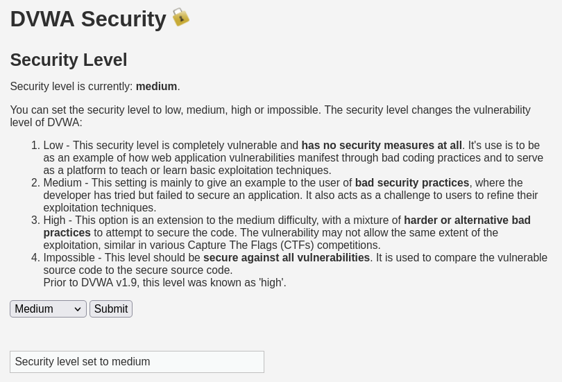
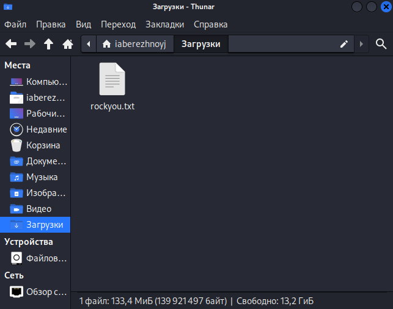
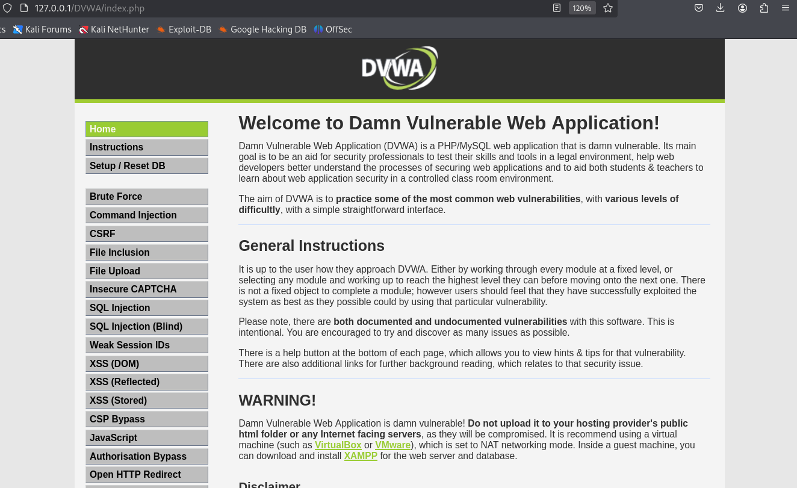
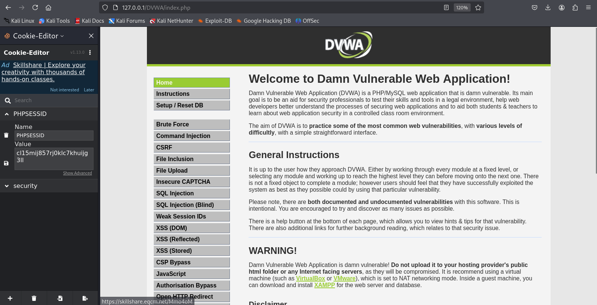
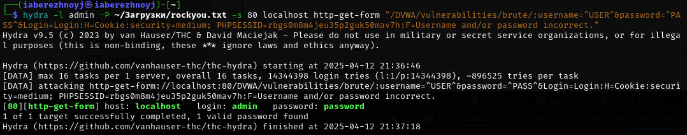

---
## Front matter
title: "Отчёт по 3-ему этапу индивидуального проекта"
subtitle: "Основы информационной безопасности"
author: "Бережной Иван Александрович"

## Generic otions
lang: ru-RU
toc-title: "Содержание"

## Bibliography
bibliography: bib/cite.bib
csl: pandoc/csl/gost-r-7-0-5-2008-numeric.csl

## Pdf output format
toc: true # Table of contents
toc-depth: 2
lof: true # List of figures
fontsize: 12pt
linestretch: 1.5
papersize: a4
documentclass: scrreprt
## I18n polyglossia
polyglossia-lang:
  name: russian
  options:
	- spelling=modern
	- babelshorthands=true
polyglossia-otherlangs:
  name: english
## I18n babel
babel-lang: russian
babel-otherlangs: english
## Fonts
mainfont: IBM Plex Serif
romanfont: IBM Plex Serif
sansfont: IBM Plex Sans
monofont: IBM Plex Mono
mainfontoptions: Ligatures=Common,Ligatures=TeX,Scale=0.94
romanfontoptions: Ligatures=Common,Ligatures=TeX,Scale=0.94
sansfontoptions: Ligatures=Common,Ligatures=TeX,Scale=MatchLowercase,Scale=0.94
monofontoptions: Scale=MatchLowercase,Scale=0.94,FakeStretch=0.9
mathfontoptions:
## Biblatex
biblatex: true
biblio-style: "gost-numeric"
biblatexoptions:
  - parentracker=true
  - backend=biber
  - hyperref=auto
  - language=auto
  - autolang=other*
  - citestyle=gost-numeric
## Pandoc-crossref LaTeX customization
figureTitle: "Рис."
tableTitle: "Таблица"
listingTitle: "Листинг"
lofTitle: "Список иллюстраций"
lotTittle: "Список таблиц"
lolTitle: "Листинги"
## Misc options
indent: true
header-includes:
  - \usepackage{indentfirst}
  - \usepackage{float} # keep figures where there are in the text
  - \floatplacement{figure}{H} # keep figures where there are in the text
---

# Цель работы

Приобрести практические навыки по использованию инструмента Hydra для брутфорса паролей DVWA.

# Задание

Забрутфорсить свой сервер.

# Теоретическое введение

**Hydra** — инструмент для перебора логинов и паролей по различным протоколам.

Брутфорс формы входа в **DVWA** (Damn Vulnerable Web Application).

1. Убедитесь, что DVWA запущено и уровень безопасности установлен на **Low**.
2. Найдите параметры формы входа (обычно: `username`, `password`, `Login`).


```bash
hydra -l admin -P passwords.txt 127.0.0.1 http-post-form "/dvwa/login.php:username=^USER^&password=^PASS^&Login=Login:Login failed"
```

# Выполнение лабораторной работы

Для начала нужно установить соответствующий уровень защиты сервера. Насколько я понял, *impossible* не получится забрутфорсить с помощью Hydra, поэтому поставим **medium** (рис. [-@fig:001]).

{#fig:001 width=70%}

Теперь найдём какой-нибудь список часто используемых паролей. Я скачал `rockyou.txt` (рис. [-@fig:002]).

{#fig:002 width=70%}

Вернёмся в базу данных (рис. [-@fig:003]) и посмотрим на куки (рис. [-@fig:004]). Они понадобятся для написания команды.

{#fig:003 width=70%}

{#fig:004 width=70%}

Вводим команду, представленную на рисунке. Она выдала подходящий пароль (рис. [-@fig:005]).

{#fig:005 width=70%}

# Выводы

В ходе выполнения этапа проекта мы попрактиковались в использовании инструмента Hydra для брутфорса паролей DVWA.
