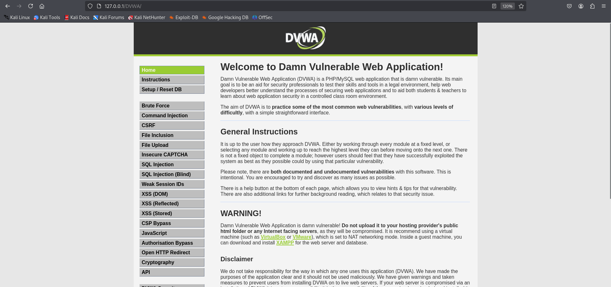

---
## Front matter
title: "Отчёт по 4-ому этапу индивидуального проекта"
subtitle: "Основы информационной безопасности"
author: "Бережной Иван Александрович"

## Generic otions
lang: ru-RU
toc-title: "Содержание"

## Bibliography
bibliography: bib/cite.bib
csl: pandoc/csl/gost-r-7-0-5-2008-numeric.csl

## Pdf output format
toc: true # Table of contents
toc-depth: 2
lof: true # List of figures
fontsize: 12pt
linestretch: 1.5
papersize: a4
documentclass: scrreprt
## I18n polyglossia
polyglossia-lang:
  name: russian
  options:
	- spelling=modern
	- babelshorthands=true
polyglossia-otherlangs:
  name: english
## I18n babel
babel-lang: russian
babel-otherlangs: english
## Fonts
mainfont: IBM Plex Serif
romanfont: IBM Plex Serif
sansfont: IBM Plex Sans
monofont: IBM Plex Mono
mainfontoptions: Ligatures=Common,Ligatures=TeX,Scale=0.94
romanfontoptions: Ligatures=Common,Ligatures=TeX,Scale=0.94
sansfontoptions: Ligatures=Common,Ligatures=TeX,Scale=MatchLowercase,Scale=0.94
monofontoptions: Scale=MatchLowercase,Scale=0.94,FakeStretch=0.9
mathfontoptions:
## Biblatex
biblatex: true
biblio-style: "gost-numeric"
biblatexoptions:
  - parentracker=true
  - backend=biber
  - hyperref=auto
  - language=auto
  - autolang=other*
  - citestyle=gost-numeric
## Pandoc-crossref LaTeX customization
figureTitle: "Рис."
tableTitle: "Таблица"
listingTitle: "Листинг"
lofTitle: "Список иллюстраций"
lotTittle: "Список таблиц"
lolTitle: "Листинги"
## Misc options
indent: true
header-includes:
  - \usepackage{indentfirst}
  - \usepackage{float} # keep figures where there are in the text
  - \floatplacement{figure}{H} # keep figures where there are in the text
---

# Цель работы

Научиться тестировать веб-приложения с помощью сканера nikto

# Задание

Использовать nikto на DVWA

# Теоретическое введение

Nikto – бесплатный сканер для поиска уязвимостей в веб-серверах. Утилита относиться к классу blackbox сканеров, т. е. сканеров, использующих стратегию сканирования методом черного ящика. Это значит, что заранее неизвестно о внутреннем устройстве программы/сайта (доступ к исходному коду отсутствует) и упор сделан на функциональность. Программа может обнаруживать более 6700 потенциально опасных файлов и уязвимостей. Новые уязвимости добавляются в базу данных программы по мере их возникновения. Помимо поиска уязвимостей, сканер производит поиск на наличие устаревших версий, используемых библиотек и фреймворков. Nikto не позиционируется как стелс сканер (стелс сканеры никогда не устанавливают TCP-соединения до конца, тем самым сканирование происходит скрытно) – при сканировании сайта в логах сайта или в любой другой системе обнаружения вторжений, если она используется, будет отображена информация о том, что сайт подвергается сканированию.

# Выполнение задания

Для начала запустим зависимости (рис. [-@fig:001]), а затем и сам DVWA (рис. [-@fig:002]).

{#fig:001 width=70%}

{#fig:002 width=70%}

Теперь запустим nikto следующей командой: `nikto -h http://127.0.0.1/DVWA/`

{#fig:003 width=70%}

Из вывода в терминале можем заключить следующее:

Отчёт Nikto выявил несколько уязвимостей и проблем безопасности в DVWA.

1. Обнаружены несколько PHP-скриптов, позволяющих управлять файлами на сервере:
	* /DVWA/wp-content/themes/twent/vector/images/headers/server.php?filesrc=/etc/hosts
	* /DVWA/login.cgi?cli=a&z9aaxZ7catX20/etc/hosts (возможна RCE для D-Link роутеров)
	* /DVWA/shell?cat+/etc/hosts (подозрительный бэкдор).
	
2. Отсутствуют заголовки безопасности:
	* Нет X-Frame-Options (риск clickjacking).
	* Нет X-Content-Type-Options (возможна подмена MIME-типов).
	
3. Доступны директории с конфигурационными данными:
/DVWAconfig/, /DVWA/database/, /DVWA/tests/ (индексация включена).

# Выводы

В ходе выполнения этапа проекта мы научились исопльзовать nikto для сканирования веб-приложения на уязвимости
