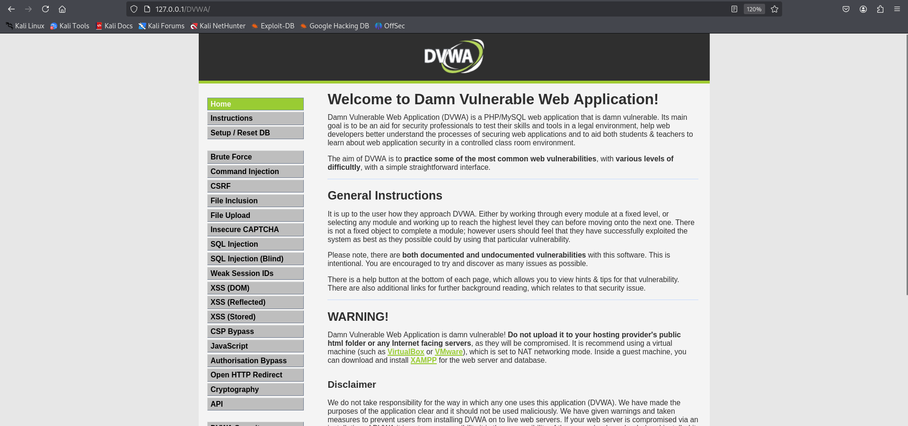
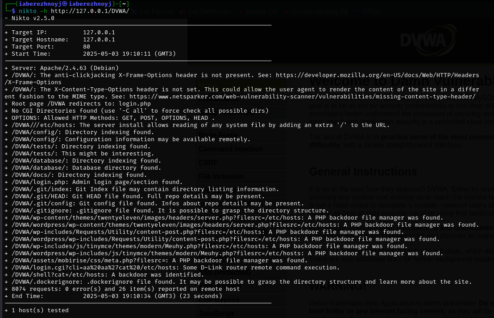

---
## Front matter
lang: ru-RU
title: Презентация по 5-ому этапу индивидуального проекта
subtitle: Основы информационной безопасности
author:
  - Бережной И. А.
institute:
  - Российский университет дружбы народов, Москва, Россия

## i18n babel
babel-lang: russian
babel-otherlangs: english

## Formatting pdf
toc: false
toc-title: Содержание
slide_level: 2
aspectratio: 169
section-titles: true
theme: metropolis
header-includes:
 - \metroset{progressbar=frametitle,sectionpage=progressbar,numbering=fraction}
---

# Информация

## Докладчик

:::::::::::::: {.columns align=center}
::: {.column width="70%"}

  * Бережной Иван Александрович
  * студент 2-ого курса
  * Российский университет дружбы народов
  * [1132236041@pfur.ru](mailto:1132236041@pfur.ru)

:::
::::::::::::::

## Цель

Научиться тестировать веб-приложения с помощью сканера nikto

## Задачи

Использовать nikto на DVWA
	
## Теоретическое введение

Nikto – бесплатный сканер для поиска уязвимостей в веб-серверах. Утилита относиться к классу blackbox сканеров, т. е. сканеров, использующих стратегию сканирования методом черного ящика. Это значит, что заранее неизвестно о внутреннем устройстве программы/сайта (доступ к исходному коду отсутствует) и упор сделан на функциональность. Программа может обнаруживать более 6700 потенциально опасных файлов и уязвимостей. Новые уязвимости добавляются в базу данных программы по мере их возникновения. Помимо поиска уязвимостей, сканер производит поиск на наличие устаревших версий, используемых библиотек и фреймворков. Nikto не позиционируется как стелс сканер (стелс сканеры никогда не устанавливают TCP-соединения до конца, тем самым сканирование происходит скрытно) – при сканировании сайта в логах сайта или в любой другой системе обнаружения вторжений, если она используется, будет отображена информация о том, что сайт подвергается сканированию.
	
# Выполнение задания

## Выполнение задания

Для начала запустим зависимости, а затем и сам DVWA.

{#fig:001 width=70%}

## Выполнение задания

Теперь запустим nikto следующей командой: `nikto -h http://127.0.0.1/DVWA/`

{#fig:002 width=70%}

## Выполнение задания

Из вывода в терминале можем заключить следующее:

Отчёт Nikto выявил несколько уязвимостей и проблем безопасности в DVWA.

1. Обнаружены несколько PHP-скриптов, позволяющих управлять файлами на сервере:
	* /DVWA/wp-content/themes/twent/vector/images/headers/server.php?filesrc=/etc/hosts.
	* /DVWA/login.cgi?cli=a&z9aaxZ7catX20/etc/hosts (возможна RCE для D-Link роутеров).
	* /DVWA/shell?cat+/etc/hosts (подозрительный бэкдор).
	
2. Отсутствуют заголовки безопасности:
	* Нет X-Frame-Options (риск clickjacking).
	* Нет X-Content-Type-Options (возможна подмена MIME-типов).
	
3. Доступны директории с конфигурационными данными:
/DVWAconfig/, /DVWA/database/, /DVWA/tests/ (индексация включена).

## Вывод

В ходе выполнения этапа проекта мы попрактиковались в использовании инструмента Hydra для брутфорса паролей DVWA.
